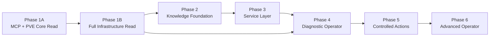
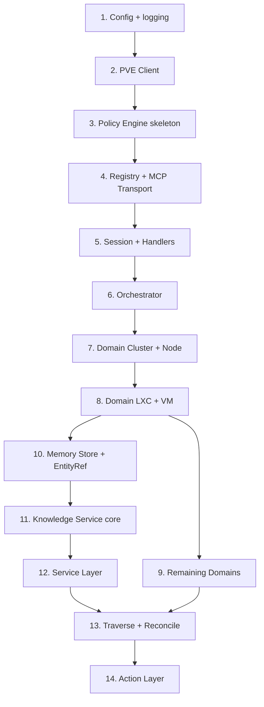

# Implementation Roadmap — AI Infrastructure Operator for Proxmox VE

**Версия:** 1.0  
**Дата:** 2026-06-03  
**Статус:** План реализации (без кода)  

**Нормативная база:**

| Документ | Роль |
|----------|------|
| [ARCHITECTURE.md](ARCHITECTURE.md) v0.2 | Runtime, MCP, Policy, Domain Services, tiers |
| [MEMORY_KNOWLEDGE_MODEL.md](MEMORY_KNOWLEDGE_MODEL.md) | Memory, Knowledge, Service, EntityRef, traverse |
| [ADR-0005…0010](adr/ADR_INDEX.md) | Позиционирование, масштаб, совместимость |

**Принцип реализации:** как можно раньше получить **полезного READ ONLY оператора**; write-возможности — позже, через Policy Engine и tiers OPERATOR/ADMIN.

**Вне scope roadmap:** multi-provider framework, абстракция Workload, смена `pve_*` namespace.

---

## 1. Обзор стратегии

### 1.1 Цель продукта

Поставить MCP-сервер, который позволяет LLM-агенту **наблюдать и рассуждать** о Proxmox VE (и позже — **безопасно действовать**) на любой инсталляции: 1..N нод, без зашитого inventory.

### 1.2 Структура фаз

Предложенные шесть фаз **сохранены**; Phase 1 разбита на две **подфазы** для ранней поставки ценности без блокировки на полном inventory API.

| Фаза | Публичная версия (ориентир) | Ценность для пользователя |
|------|----------------------------|---------------------------|
| **1A** | `0.1.0-alpha` | «Агент видит кластер, ноды, гостей» |
| **1B** | `0.2.0` | «Полный обзор инфраструктуры PVE» |
| **2** | `0.3.0` | «Оператор помнит заметки и ADR» |
| **3** | `0.4.0` | «Сервисы привязаны к LXC/VM» |
| **4** | `1.0.0` | «Диагностика Service → Cluster» |
| **5** | `2.0.0` | «Контролируемые действия» |
| **6** | `2.x` / `3.0.0` | «Зрелый оператор» |

### 1.3 Параллелизация

| Можно параллелить | После чего |
|-------------------|------------|
| Domain-модули внутри Phase 1B | PVE Client + Registry |
| Contract tests per domain | Первый tool домена |
| Docker/deploy | Phase 1A |
| ADR surfacing (Phase 2) | Memory store skeleton |
| Backup domain (Phase 1B) | Capability discovery (ADR-0008) |

---

## 2. Phase 1A — Core MCP + Proxmox Read (Minimal)

### 2.1 Цель

Запустить MCP-сервер, подключённый к PVE, с **минимальным** набором READ tools: кластер, ноды, список/статус LXC и VM. Подтвердить транспорт, auth, orchestration N нод.

### 2.2 Состав подсистем

| Подсистема | Scope 1A |
|------------|----------|
| MCP Transport | stdio (приоритет); SSE — stub или Phase 1B |
| Session + correlation id | да |
| Tool Registry | статическая регистрация, tier READ |
| Policy Engine | **READ_ONLY hardcoded**; все tools READ |
| PVE Client | token auth, retry, TLS, PveApiError |
| Orchestrator | fan-out nodes, limits ADR-0009 (базовые) |
| Cache | TTL для cluster resources (опционально) |
| Domains | **Cluster, Node, LXC, VM** (list + status только) |
| Audit | JSON-lines вызовов tools |
| Knowledge | **нет** |
| Deploy | Dockerfile + compose minimal |

### 2.3 Зависимости

- **ADR-0001** (язык) — желательно закрыть до старта кодирования.  
- **ADR-0002** (transport) — stdio для 1A.  
- Тестовый PVE или mock HTTP.

### 2.4 Definition of Done

- [ ] MCP-клиент (Cursor/OWUI) вызывает `pve_cluster_status`, `pve_nodes_list`, `pve_lxc_list`, `pve_qemu_list`, `pve_*_status` на **standalone и multi-node**.  
- [ ] Пагинация `limit`/`offset` на list tools.  
- [ ] При недоступной ноде — `partial_results` + `errors[]`.  
- [ ] Конфиг: `PVE_HOST`, token, `cluster_id` / connection id.  
- [ ] README: быстрый старт ≤ 15 минут.  
- [ ] Unit tests: PVE client, policy deny non-READ (если зарегистрирован write-stub).  
- [ ] Integration: 1 тест против mock PVE.

### 2.5 Риски

| Риск | Митигация |
|------|-----------|
| Выбор языка затягивает старт | Закрыть ADR-0001 за 1 спринт |
| Неверный fan-out на multi-node | Ранний тест на 2+ нодах |
| TLS/self-signed PVE | `verify_ssl` в конфиге |

### 2.6 Сложность

**M** (1 разработчик: ~2–3 недели календарно при part-time; ~1–1.5 недели full-time).

### 2.7 MCP tools (Phase 1A)

| Tool | Domain |
|------|--------|
| `pve_cluster_status` | Cluster |
| `pve_cluster_resources` | Cluster (bounded) |
| `pve_nodes_list` | Node |
| `pve_node_status` | Node |
| `pve_lxc_list` | LXC |
| `pve_lxc_status` | LXC |
| `pve_qemu_list` | VM |
| `pve_qemu_status` | VM |

### 2.8 Внутренние сервисы

`main`, `mcp/transport`, `mcp/registry`, `mcp/handlers`, `mcp/session`, `policy/engine` (minimal), `pve/client`, `pve/auth`, `orchestrator`, `domains/{cluster,nodes,lxc,vms}`, `audit`, `config`, `cache` (optional).

### 2.9 Модели данных

- DTO: `ClusterStatus`, `NodeSummary`, `GuestRef` (`node:vmid`), `GuestStatus`.  
- Config schema v1.  
- **Без** SQLite.

### 2.10 Тесты

| Тип | Что |
|-----|-----|
| Unit | HTTP client, auth header, error mapping, pagination helpers |
| Contract | JSON snapshot для каждого tool 1A |
| Integration | mock PVE multi-node |
| Manual | OWUI/Cursor smoke |

---

## 3. Phase 1B — Full Infrastructure Read

### 3.1 Цель

Покрыть **все** Infrastructure-подсистемы READ v1: Storage, Network, Task, Logs, Update, Backup + углубление LXC/VM (config, rrddata) + агрегирующие tools.

### 3.2 Состав подсистем

| Подсистема | Scope |
|------------|-------|
| Domains | Storage, Network, Task, Logs, Update, Backup |
| LXC/VM | config, rrddata |
| Capability discovery | ADR-0008 (`sdn`, `backup_api`, `cluster_mode`) |
| Orchestrator | aggregate tools, `aggregate_threshold` |
| Resources | `pve://cluster/summary`, `pve://node/{name}/status`, guest URIs |
| Tool Catalog | автоген/полуавтоген `TOOL_CATALOG.md` |

### 3.3 Зависимости

- Phase 1A complete.  
- **ADR-0004** (network scope), **ADR-0011** (backup scope) — желательно до Backup/Network.

### 3.4 Definition of Done

- [ ] Все READ tools §ARCHITECTURE для Infrastructure (кроме Knowledge) реализованы или помечены `CapabilityUnavailable`.  
- [ ] `pve_cluster_overview`, `pve_guests_list_all` с `truncated` при большом inventory.  
- [ ] Compatibility matrix в README (PVE 8/9).  
- [ ] Contract tests per domain; integration test suite green на mock.  
- [ ] OPERATIONS.md draft (backup volume не требуется в 1B).

### 3.5 Риски

| Риск | Митигация |
|------|-----------|
| Scope creep Logs/SDN | Capability flags + отключение в конфиге |
| RRD нагрузка на PVE | Лимиты timeframe/resolution |

### 3.6 Сложность

**L** (~3–4 недели full-time после 1A).

### 3.7 MCP tools (добавление к 1A)

| Группа | Tools (эскиз) |
|--------|----------------|
| LXC/VM | `pve_lxc_config`, `pve_qemu_config`, `pve_lxc_rrddata`, `pve_qemu_rrddata` |
| Storage | `pve_storage_list`, `pve_storage_status`, `pve_storage_content` |
| Network | `pve_network_interfaces`, `pve_sdn_status`, `pve_firewall_rules_list` |
| Task | `pve_tasks_list`, `pve_task_status`, `pve_task_log` |
| Logs | `pve_syslog`, `pve_journal` |
| Update | `pve_updates_list`, `pve_repositories_get`, `pve_versions` |
| Backup | `pve_backup_list`, `pve_backup_job_status`, … (ADR-0011) |
| Aggregate | `pve_cluster_overview`, `pve_guests_list_all` |

### 3.8 Внутренние сервисы

`domains/{storage,network,tasks,logs,updates,backup}`, `pve/capabilities`, resource handlers, catalog generator script.

### 3.9 Модели данных

- DTO для каждой подсистемы; `CapabilitySet`; normalized `PveListResponse<T>` с pagination meta.

### 3.10 Тесты

- Contract snapshots per tool.  
- Integration: capability off → `CapabilityUnavailable`.  
- Load smoke: list 1000 guests mock → truncated aggregate.

---

## 4. Phase 2 — Knowledge Foundation

### 4.1 Цель

Локальная **Memory** без Service Layer: EntityRef, заметки, поиск, ADR; задел под Knowledge Service.

### 4.2 Состав подсистем

| Компонент | Scope |
|-----------|--------|
| Memory Store | SQLite `schema_version=1.0` |
| EntityRef | валидация, URI, resolve |
| Knowledge Service | persist, search, resolve (без traverse) |
| Memory tools | search, get, list, note_create |
| ADR tools | list, get; resources `pve://adr/*` |
| Reconcile | **lazy** только для refs в notes (опционально) |
| Policy | `memory.allow_write` (ADR-0003) |

### 4.3 Зависимости

- Phase 1A (нужен `cluster_id`, live probe для lazy reconcile).  
- [MEMORY_KNOWLEDGE_MODEL.md](MEMORY_KNOWLEDGE_MODEL.md) §4, §6, §10.

### 4.4 Definition of Done

- [ ] `pve_memory_*`, `pve_knowledge_resolve`, `pve_adr_*` работают.  
- [ ] `entity_note` с `entity_refs` (LXC/VM/Node/…).  
- [ ] Пагинация search/list (ADR-0009).  
- [ ] Volume `data/` в deploy; backup doc.  
- [ ] Unit: EntityRef validation; integration: note + resolve.

### 4.5 Риски

| Риск | Митигация |
|------|-----------|
| Миграции SQLite | schema_version с day-1 |
| Запись в READ_ONLY | ADR-0003 default `allow_write=true` для local |

### 4.6 Сложность

**M** (~2 недели full-time).

### 4.7 MCP tools

`pve_memory_search`, `pve_memory_get`, `pve_memory_list`, `pve_memory_note_create`, `pve_knowledge_resolve`, `pve_adr_list`, `pve_adr_get`.

### 4.8 Модели данных

`EntityRef`, `MemoryRecord`, `edges` (documents only), tables §Memory doc §10.2.

### 4.9 Тесты

- Unit: ref parse/serialize, stale marking logic (mock PVE).  
- Integration: CRUD notes, search filters, ADR read from `docs/adr/`.

---

## 5. Phase 3 — Service Layer

### 5.1 Цель

**Service** как сущность Memory: CRUD, dependencies, `runs_on` → LXC/VM, lazy reconcile, Service list/get.

### 5.2 Состав подсистем

| Компонент | Scope |
|-----------|--------|
| `services` table + edges | `runs_on`, `depends_on` |
| Service validation | ADR-0010 types, HealthStatus |
| Tools | service_list/get/upsert/delete/link |
| Reconcile | lazy on `pve_service_get` |
| Resources | `pve://memory/services` |

### 5.3 Зависимости

- Phase 2 (EntityRef, Memory store).  
- Phase 1A (guest status for RunsOn validation).

### 5.4 Definition of Done

- [ ] Полный CRUD Service по Memory Model §3.2, §5.  
- [ ] max 32 dependencies; cycle detection при link.  
- [ ] `stale` при удалённом госте.  
- [ ] Audit events `service.upsert`.  
- [ ] JSON Schema validation для Service (tests).

### 5.5 Риски

| Риск | Митигация |
|------|-----------|
| Агент создаёт мусорные Service | документация + optional dedup by name в v1.1 |
| RunsOn invalid | 404 → `RunsOnNotFound` |

### 5.6 Сложность

**M** (~2 недели full-time).

### 5.7 MCP tools

`pve_service_list`, `pve_service_get`, `pve_service_upsert`, `pve_service_delete`, `pve_service_link`.

### 5.8 Тесты

- Unit: dependency cycle, type enum, RunsOn validation.  
- Integration: Service → reconcile → stale on guest delete (mock).

---

## 6. Phase 4 — Diagnostic Operator

### 6.1 Цель

Связать Service Layer с Infrastructure READ: **traverse**, scheduled reconcile, diagnostic playbook, MCP prompts (optional).

### 6.2 Состав подсистем

| Компонент | Scope |
|-----------|--------|
| `pve_knowledge_traverse` | down/up/dependencies, live state, suggested_checks |
| `pve_knowledge_reconcile` | on_demand + scheduled job |
| Traversal engine | BFS, max 64 nodes, 16 concurrent PVE |
| Correlation | tasks/logs optional flags |
| Prompts | `diagnose_service`, `cluster_overview` (v1.0 polish) |
| snapshot_bookmark | reconcile cluster inventory |

### 6.3 Зависимости

- Phase 3 (Service).  
- Phase 1B (domains для live state).  
- **ADR-0012** (traversal) — можно принять в начале фазы.

### 6.4 Definition of Done

- [ ] Playbook §Memory 8.2 выполняется через tools (manual E2E script).  
- [ ] Traverse: Service→LXC|VM→Node→Cluster с `include_live_state=true`.  
- [ ] `truncated`, `GraphCycleDetected`, `CapabilityUnavailable` покрыты тестами.  
- [ ] Scheduled reconcile не блокирует MCP (background worker).  
- [ ] **Release v1.0.0** критерии MVP (§7) выполнены.

### 6.5 Риски

| Риск | Митигация |
|------|-----------|
| Traverse DDoS PVE | semaphores ADR-0009 |
| Сложность отладки | structured logs + traverse id |

### 6.6 Сложность

**L** (~3 недели full-time).

### 6.7 MCP tools

`pve_knowledge_traverse`, `pve_knowledge_reconcile`; prompts (если в v1.0).

### 6.8 Тесты

- Unit: graph BFS, cycle, truncation.  
- Integration: full playbook mock cluster.  
- E2E: «service unhealthy» scenario (scripted).

---

## 7. Phase 5 — Controlled Actions

### 7.1 Цель

OPERATOR tier с **CONFIRMATION_REQUIRED**: plan → confirm → execute; безопасные lifecycle операции.

### 7.2 Состав подсистем

| Компонент | Scope |
|-----------|--------|
| Policy modes | READ_ONLY, CONFIRMATION_REQUIRED, FULL_ADMIN (flag) |
| Pending plans store | `data/pending/` TTL |
| Tools | `pve_operator_plan`, `pve_operator_execute` |
| OPERATOR domains | start/stop/shutdown, snapshot, migrate (приоритизировать) |
| PVE Client | POST/PUT mutate |
| Audit | mutate events обязательны |

### 7.3 Зависимости

- Phase 4 (стабильный READ + audit).  
- Отдельный PVE token с PowerMgmt (документация).

### 7.4 Definition of Done

- [ ] Default deploy остаётся READ_ONLY.  
- [ ] CONFIRMATION flow E2E для `pve_qemu_start` / `stop`.  
- [ ] OPERATOR tools не вызываются без valid confirm token.  
- [ ] Release **v2.0.0**.

### 7.5 Риски

| Риск | Митигация |
|------|-----------|
| LLM accidental mutate | plan/confirm + READ_ONLY default |
| Blast radius | whitelist OPERATOR tools v2.0 |

### 7.6 Сложность

**XL** (~4–6 недель).

### 7.7 MCP tools (эскиз)

`pve_operator_plan`, `pve_operator_execute`, `pve_qemu_start/stop`, `pve_lxc_start/stop`, `pve_*_snapshot`, …

### 7.8 Тесты

- Policy unit tests всех режимов.  
- Integration: plan expiry, token reuse denied.  
- **Нет** mutate на shared prod в CI — только mock.

---

## 8. Phase 6 — Advanced Operator

### 8.1 Цель

ADMIN tier, расширенная автоматизация, зрелость эксплуатации.

### 8.2 Состав (приоритизированный backlog)

| Область | Элементы |
|---------|----------|
| ADMIN CRUD | create/destroy VM/CT, storage, network |
| FULL_ADMIN policy | отдельный флаг + токен |
| Knowledge v1.1+ | FTS5, semantic search (EXP) |
| Updates/upgrade | `pve_upgrade_run` (ADMIN) |
| Multi-connection | несколько `cluster_id` в одном процессе |
| Observability | Prometheus metrics, trace |
| HA deploy | health checks, graceful shutdown |

### 8.3 Зависимости

- Phase 5 stable.

### 8.4 Definition of Done

- По каждому epic — отдельный minor release + ADR при необходимости.

### 8.5 Сложность

**XL+** (непрерывный backlog).

---

## 9. MVP Definition

### 9.1 Минимум, при котором проект **уже полезен** (Early MVP = end of **Phase 1A**)

Агент в MCP-клиенте может:

- увидеть состояние кластера и нод;  
- перечислить LXC/VM и их статус на любой топологии N≥1;  
- получить частичный ответ при сбое ноды.

**Не нужно:** Memory, Service, traverse, Storage, mutate.

### 9.2 Расширенная полезность (**Phase 1B**)

Полный инфраструктурный обзор READ: storage, tasks, logs, updates — «AI сисадмин с глазами на PVE».

### 9.3 **Первая публичная версия — v1.0.0** (рекомендация)

| Включить | Фаза |
|----------|------|
| Все Infrastructure READ + capabilities | 1B |
| Memory notes + EntityRef + ADR | 2 |
| Service CRUD + dependencies | 3 |
| Traverse + reconcile on_demand | 4 |
| Docker deploy + README + TOOL_CATALOG | 1B–4 |
| Policy READ_ONLY + memory.allow_write | 2–4 |

| Отложить после v1.0.0 | Причина |
|------------------------|---------|
| OPERATOR/ADMIN mutate | безопасность |
| `pve_memory_note_update` | nice-to-have |
| FTS5 semantic search | v1.1 |
| MCP prompts library | v1.1 (можно 1–2 prompt в v1.0) |
| Scheduled reconcile | можно v1.0.1; on_demand достаточно для v1.0 |
| Backup domain | если capability — v1.0, иначе v1.0.1 |

### 9.4 Критерии готовности v1.0.0 (сводные)

1. READ_ONLY only для PVE API.  
2. Работа на standalone + multi-node без конфигурации числа нод.  
3. Service Layer + traverse playbook вручную проверен.  
4. Документация: ARCHITECTURE (актуализирован), MEMORY, ROADMAP, TOOL_CATALOG, ADR index.  
5. CI: unit + contract + mock integration green.  
6. Нет нормативных имён продуктов в коде/схемах.

---

## 10. Technical Debt Strategy

### 10.1 Можно упростить в MVP

| Упрощение | Допустимо до | Долг |
|-----------|--------------|------|
| SSE transport — только stdio | v1.0 | ADR-0002; добавить SSE v1.0.1 |
| Scheduled reconcile — только on_demand + lazy | v1.0.0 | фоновый worker v1.0.1 |
| FTS — LIKE/substring search | v1.0 | FTS5 v1.1 |
| In-memory pending plans | v2.0 dev | SQLite pending v2.0 prod |
| Один `cluster_id` / процесс | v1.x | multi-connection v2.x |
| Contract tests без PVE 8 live | v1.0 | CI matrix 8+9 v1.0.1 |
| Prompts вручную в docs вместо MCP prompts | v1.0 | MCP prompts v1.1 |

### 10.2 Обязательно сделать сразу (не откладывать)

| Элемент | Фаза | Почему |
|---------|------|--------|
| Policy Engine hook (даже если только READ) | 1A | иначе ломается Phase 5 |
| Pagination + fan-out limits | 1A | ADR-0009, большие кластеры |
| EntityRef + schema_version | 2 | миграция данных дороже позже |
| PveApiError + correlation id | 1A | отладка |
| Capability discovery | 1B | ADR-0008, graceful degrade |
| Audit log append-only | 1A | compliance для mutate |
| Tool Registry с tier metadata | 1A | каталог tools |
| Раздельные LXC/VM domains | 1A | ADR-0005/0006 |

### 10.3 Отложить безопасно

| Элемент | Целевая фаза |
|---------|--------------|
| Semantic embeddings | 6 / EXP |
| ADMIN create/destroy | 6 |
| Multi-provider | never в scope |
| Postgres memory backend | 6 |
| Full OPERATIONS runbooks | post v1.0 |

---

## 11. Recommended Build Order

Порядок реализации **внутри кодовой базы** (вертикальные срезы — по фазам выше).

| # | Компонент | Фаза | Комментарий |
|---|-----------|------|-------------|
| 1 | **Config** | 1A | YAML + env, `cluster_id`, SSL |
| 2 | **PVE Client** | 1A | Блокирует все domains |
| 3 | **Policy Engine** | 1A | READ_ONLY; расширение в 5 |
| 4 | **Registry + Transport** | 1A | MCP wire-up |
| 5 | **Session + Handlers** | 1A | |
| 6 | **Orchestrator** | 1A | Fan-out, pagination |
| 7 | **Domain Cluster, Node** | 1A | Первый E2E |
| 8 | **Domain LXC, VM** | 1A | |
| 9 | **Domain Storage…Backup** | 1B | Параллель по доменам |
| 10 | **Memory Store + EntityRef** | 2 | SQLite schema 1.0 |
| 11 | **Knowledge Service** (без traverse) | 2 | resolve, notes, ADR |
| 12 | **Service Layer** | 3 | |
| 13 | **Traverse + Reconcile** | 4 | Зависит от 11–12 + domains |
| 14 | **Action Layer** | 5 | plan/execute + mutate client |

**Cache:** после Orchestrator (1A), расширять в 1B.  
**Audit:** с первого handler (1A).  
**Resources:** после соответствующих domains (1B, 2).

---

## 12. Сводная таблица фаз

| Phase | Цель (кратко) | Сложность | Зависит от |
|-------|---------------|-----------|------------|
| 1A | MCP + core READ | M | ADR-0001, 0002 |
| 1B | Full Infrastructure READ | L | 1A |
| 2 | Knowledge Foundation | M | 1A |
| 3 | Service Layer | M | 2 |
| 4 | Diagnostic Operator | L | 1B, 3 |
| 5 | Controlled Actions | XL | 4 |
| 6 | Advanced Operator | XL+ | 5 |

---

## 13. MVP Task List

Конкретные задачи для **первой реализации до v1.0.0**. Формат: `[ID]` Название — (Фаза).

### 13.0 Подготовка (до кода)

| ID | Задача |
|----|--------|
| T-000 | Принять ADR-0001 (язык реализации) |
| T-001 | Принять ADR-0002 (stdio v1, SSE backlog) |
| T-002 | Принять ADR-0003 (`memory.allow_write` default) |
| T-003 | Синхронизировать ARCHITECTURE.md с MEMORY + ADR (v0.2) |
| T-004 | Создать репозиторий: структура `src/`, CI skeleton, LICENSE, README |
| T-005 | Mock PVE HTTP fixture (multi-node, pagination) |

### 13.1 Phase 1A — Core

| ID | Задача |
|----|--------|
| T-100 | Config loader + schema validation |
| T-101 | Structured logging + correlation id middleware |
| T-102 | PVE HTTP client: auth, retry, TLS, error mapping |
| T-103 | Policy Engine: READ_ONLY, tier on registry |
| T-104 | Tool Registry + MCP stdio server bootstrap |
| T-105 | Session context (connection id, session id) |
| T-106 | Orchestrator: node list discovery, fan-out semaphore |
| T-107 | Domain Cluster: status, resources |
| T-108 | Domain Node: list, status |
| T-109 | Domain LXC: list, status |
| T-110 | Domain VM: list, status |
| T-111 | MCP handlers wire-up для tools 1A |
| T-112 | Audit JSON-lines writer |
| T-113 | Unit tests: client, policy, pagination |
| T-114 | Contract tests: 8 tools Phase 1A |
| T-115 | Integration test: mock multi-node |
| T-116 | README quickstart + example env |
| T-117 | Dockerfile + compose (MCP only) |

### 13.2 Phase 1B — Infrastructure READ

| ID | Задача |
|----|--------|
| T-200 | Capability discovery module (ADR-0008) |
| T-201 | Domain Storage (list, status, content) |
| T-202 | Domain Network (interfaces; SDN gated) |
| T-203 | Domain Task (list, status, log) |
| T-204 | Domain Logs (syslog, journal caps) |
| T-205 | Domain Update (list, repos, versions) |
| T-206 | Domain Backup (ADR-0011, gated) |
| T-207 | LXC/VM config + rrddata tools |
| T-208 | `pve_cluster_overview`, `pve_guests_list_all` truncated logic |
| T-209 | MCP Resources: cluster, node, guest URIs |
| T-210 | Cache TTL per tool config |
| T-211 | Script/tool: generate TOOL_CATALOG.md |
| T-212 | Contract tests: all Phase 1B tools |
| T-213 | README compatibility matrix PVE 8/9 |

### 13.3 Phase 2 — Knowledge Foundation

| ID | Задача |
|----|--------|
| T-300 | SQLite schema v1.0 + migrations framework |
| T-301 | EntityRef model: parse, validate, URI serialize |
| T-302 | Memory repository: memories, entity_ref_index |
| T-303 | Knowledge Service: resolve, search, list, get |
| T-304 | `pve_memory_*` handlers |
| T-305 | `pve_knowledge_resolve` |
| T-306 | ADR reader from `docs/adr/` + `pve_adr_*` |
| T-307 | `pve_memory_note_create` + policy memory.allow_write |
| T-308 | Lazy reconcile hook для refs в notes |
| T-309 | Resources: `pve://memory/*`, `pve://ref/*` |
| T-310 | Unit + integration tests Memory |
| T-311 | Deploy: volume mount `data/` |

### 13.4 Phase 3 — Service Layer

| ID | Задача |
|----|--------|
| T-400 | SQLite: services, edges tables |
| T-401 | Service model + JSON Schema validation (ADR-0010) |
| T-402 | `pve_service_upsert` / get / list / delete |
| T-403 | `pve_service_link` + cycle detection |
| T-404 | RunsOn validation via PVE guest status |
| T-405 | Lazy reconcile на service get |
| T-406 | Audit: service.upsert events |
| T-407 | Resource `pve://memory/services` |
| T-408 | Integration tests: Service lifecycle + stale |

### 13.5 Phase 4 — Diagnostic (v1.0.0 release)

| ID | Задача |
|----|--------|
| T-500 | Traversal engine: BFS, depth, truncation |
| T-501 | Live state fetcher (semaphore 16) |
| T-502 | `suggested_checks` templates by kind |
| T-503 | `pve_knowledge_traverse` handler |
| T-504 | `pve_knowledge_reconcile` on_demand |
| T-505 | snapshot_bookmark on reconcile |
| T-506 | Background scheduled reconcile (optional v1.0.1: T-505b) |
| T-507 | E2E playbook test script |
| T-508 | MCP prompt `diagnose_service` (optional) |
| T-509 | CHANGELOG v1.0.0, git tag, release notes |
| T-510 | Security pass: secrets, SSRF host pinning |

### 13.6 Post-v1.0 (не MVP, backlog)

| ID | Задача | Фаза |
|----|--------|------|
| T-600 | SSE MCP transport | 1B debt |
| T-601 | FTS5 memory search | 6 |
| T-602 | `pve_operator_plan` / execute | 5 |
| T-603 | OPERATOR lifecycle tools | 5 |
| T-604 | ADMIN CRUD tools | 6 |

---

## 14. Связь с документацией

| После завершения | Обновить |
|------------------|----------|
| Phase 1A | README quickstart |
| Phase 1B | TOOL_CATALOG.md, OPERATIONS draft |
| Phase 2–3 | — (MEMORY уже normative) |
| Phase 4 / v1.0 | CHANGELOG, ARCHITECTURE v0.2 статус stable |
| Phase 5 | ADR mutate policy, OPERATIONS |

---

## 15. Резюме

Roadmap поставляет **работающего READ ONLY оператора** уже после **Phase 1A** (~минимальный MVP), расширяет до полного инфраструктурного обзора в **1B**, затем наращивает **уникальную ценность AI-оператора** через Memory, Service и Diagnostic traverse (**v1.0.0**). Mutate и ADMIN — **Phase 5–6**, с обязательным Policy и plan/confirm, без превращения проекта в universal framework.

**Следующий шаг:** выполнение **Phase 1A** — MVP Task List §13.0–13.1 (ARCHITECTURE v0.2 завершён).

---

*Код не является частью этого документа.*
