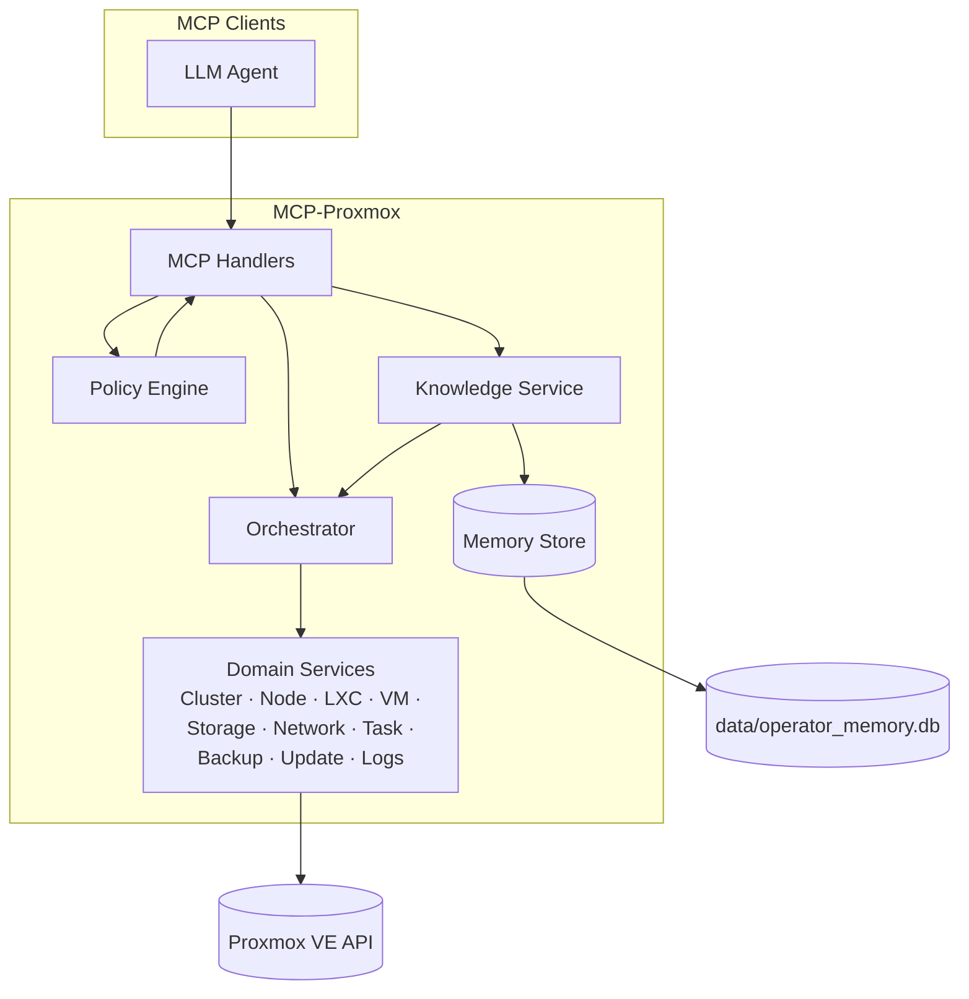
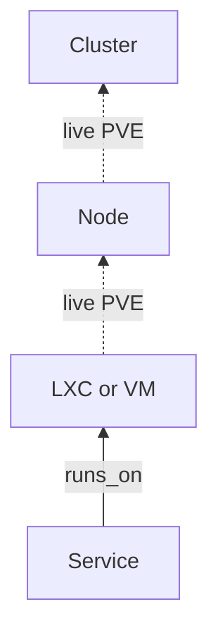

# Infrastructure Memory & Knowledge Model

**Версия:** 1.0  
**Статус:** Accepted — нормативная спецификация  
**Дата:** 2026-06-03  
**Проект:** MCP-Proxmox — AI Infrastructure Operator для Proxmox VE  

**Назначение документа:** единственный нормативный источник истины по памяти и знаниям оператора. [ARCHITECTURE.md](ARCHITECTURE.md) v0.2 и последующие ADR **ссылаются** на этот документ и **не дублируют** его содержание.

**Принятые ADR (обязательны к исполнению вместе с этим документом):**

| ADR | Тема |
|-----|------|
| [0005](adr/0005-ai-proxmox-operator-positioning.md) | AI Operator для Proxmox VE, instance-agnostic |
| [0006](adr/0006-two-level-knowledge-model.md) | Infrastructure Layer + Service Layer |
| [0007](adr/0007-entityref.md) | EntityRef |
| [0008](adr/0008-pve-compatibility-matrix.md) | Версии PVE, capability flags |
| [0009](adr/0009-scalability-limits.md) | Пагинация, fan-out, лимиты Memory |
| [0010](adr/0010-service-type-taxonomy.md) | Service.Type, HealthStatus |

---

## 1. Назначение, границы, принципы

### 1.1 Назначение

Спецификация описывает:

1. **Что** оператор запоминает локально и **что** всегда читает из Proxmox VE API.  
2. **Как** идентифицируются объекты (`EntityRef`) в любой инсталляции.  
3. **Как** строится граф знаний и диагностическая цепочка `Service → LXC|VM → Node → Cluster`.  
4. **Как** память согласуется с PVE (reconciliation) без привязки к размеру кластера.  
5. **Как** Knowledge экспонируется через MCP (tools, resources, лимиты).

### 1.2 Границы

| В scope | Out of scope |
|---------|--------------|
| Логическая модель данных Memory & Knowledge | SQL DDL, миграции, код |
| EntityRef, Service, записи Memory | Замена PVE как SoT для Infrastructure |
| Reconciliation, traversal, diagnostic playbooks | Встроенный каталог продуктов/вендоров |
| MCP-контракт Knowledge tools (v1) | Policy Engine (см. ARCHITECTURE v0.2) |
| Лимиты и пагинация Knowledge | Реализация domain tools PVE |

### 1.3 Архитектурные принципы

| # | Принцип | Источник |
|---|---------|----------|
| P1 | **Instance-agnostic** — нет нормативных предположений о числе нод, гостей, сервисов | ADR-0005 |
| P2 | **Proxmox-native Infrastructure** — отдельные kinds `lxc` и `vm`, не абстракция Workload | ADR-0005, 0006 |
| P3 | **Два уровня знаний** — Infrastructure (PVE) + Service (Memory) | ADR-0006 |
| P4 | **PVE API = SoT** для Infrastructure; **Memory = SoT** для Service и семантического обогащения | ADR-0006, 0007 |
| P5 | **EntityRef** — единственный способ ссылаться на объекты в Memory, Dependencies, Audit | ADR-0007 |
| P6 | **Без нормативных имён продуктов** в схемах и логике оператора | ADR-0010 |
| P7 | **Масштабируемость** — пагинация, bounded traversal, batch reconcile | ADR-0009 |
| P8 | **Graceful degradation** — недоступные API PVE (SDN, backup) не ломают Memory | ADR-0008 |

### 1.4 Термины

| Термин | Определение |
|--------|-------------|
| **Memory** | Локальное персистентное хранилище оператора |
| **Knowledge** | Совокупность Memory + правил графа + операций reconcile/traverse |
| **Infrastructure Layer** | Объекты PVE, идентифицируемые через EntityRef kinds §4 |
| **Service Layer** | Логические сервисы пользователя/агента, сущность `Service` |
| **Knowledge Service** | Логический компонент MCP-сервера: Memory + граф + reconcile + traverse |
| **connection / cluster_id** | Идентификатор одного подключения оператора к PVE endpoint |
| **Live state** | Данные, полученные из PVE API в момент запроса |
| **Enrichment** | Заметки, Service, dependencies — только в Memory |

---

## 2. Место в архитектуре MCP-сервера



### 2.1 Обязанности Knowledge Service

| Обязанность | Описание |
|-------------|----------|
| **Persist** | CRUD записей Memory и Service (в пределах policy) |
| **Resolve** | EntityRef → URI, валидация kind/layer |
| **Graph** | Рёбра `runs_on`, `depends_on`, `documents` |
| **Reconcile** | Сверка ref с PVE, установка `stale` |
| **Traverse** | Diagnostic graph с bounded depth и live state |
| **Search** | Поиск по Memory (FTS в реализации v1.1+, list/filter в v1) |

Knowledge Service **не** кэширует полные конфиги гостей дольше TTL сессии traverse; для конфигурации вызывает domain tools через Orchestrator.

### 2.2 Классификация данных

| Класс | Примеры | Хранение | TTL / жизненный цикл |
|-------|---------|----------|----------------------|
| **A — PVE Live** | status, rrddata, task log | Не в Memory | Только в ответе tool |
| **B — PVE Bookmark** | snapshot inventory summary | Memory `snapshot_bookmark` | Обновляется reconcile; не SoT |
| **C — Service** | Service entity | Memory `services` | До удаления пользователем/агентом |
| **D — Enrichment** | entity_note, incident, runbook | Memory `memories` | Персистентно; `stale` не удаляет |
| **E — Architecture** | ссылка на ADR | `docs/adr/` + memory `decision` | Версионируется в git |

---

## 3. Двухуровневая модель знаний

### 3.1 Infrastructure Layer (уровень 1)

Нормативный перечень kinds (ADR-0006). Соответствие подсистемам PVE:

| Kind | Подсистема PVE | Роль в диагностике |
|------|----------------|-------------------|
| `cluster` | Cluster | Верх scope, quorum, summary |
| `node` | Node | Ресурсы, версия, доступность |
| `lxc` | Containers | Гость LXC |
| `vm` | Virtual Machines | Гость QEMU/KVM |
| `storage` | Storage | Пулы, capacity, content |
| `network` | Network | Bridge, iface, SDN (если capability) |
| `task` | Tasks | Асинхронные операции PVE |
| `backup` | Backup | Jobs, snapshots (если capability) |
| `update` | Update | Bookmark состояния репозиториев/версий на ноде |

**Правило:** атрибуты Infrastructure (CPU, mem, disk, state=guest status) получаются через **live read** domain tools, не копируются в Memory как SoT.

### 3.2 Service Layer (уровень 2)

Единственная универсальная сущность приложений — **Service**.

| Поле | Тип | Обяз. | Описание |
|------|-----|-------|----------|
| `id` | UUID v4 | да | Первичный ключ в Memory |
| `name` | string 1..256 | да | Имя инстанса (произвольное, не продукт) |
| `type` | enum | да | ADR-0010 |
| `runs_on` | EntityRef | да | `kind` ∈ {`lxc`,`vm`} |
| `dependencies` | EntityRef[] | нет | Service и/или Infrastructure |
| `health_status` | enum | да | ADR-0010 |
| `metadata` | object | нет | §5.4 |
| `cluster_id` | string | да | Изоляция подключения |
| `created_at` | ISO8601 | да | |
| `updated_at` | ISO8601 | да | |
| `stale` | boolean | да | §7 |

### 3.3 Диагностическая цепочка (нормативная)

При расследовании проблемы **Service** агент **обязан** иметь возможность пройти цепочку:

```
Service --runs_on--> (LXC | VM) --hosted_on--> Node --member_of--> Cluster
```

- `hosted_on` и `member_of` — **не хранятся** в Memory; выводятся из PVE при traverse.  
- Обход `Service → Node` без гостя **запрещён** в v1.



### 3.4 Граф связей (нормативные рёбра)

| relation | from | to | Хранится в Memory |
|----------|------|-----|-------------------|
| `runs_on` | Service | LXC, VM | да (`edges`) |
| `depends_on` | Service | Service, Storage, Network, … | да |
| `documents` | memory record | любой ref | да |
| `alias_of` | alias record | target ref | да |
| `hosted_on` | LXC, VM | Node | нет (live) |
| `member_of` | Node | Cluster | нет (live) |

**Циклы** в `depends_on` допустимы; traverse обязан детектировать цикл и возвращать ошибку `GraphCycleDetected`.

---

## 4. EntityRef

Нормативная спецификация (расширяет ADR-0007).

### 4.1 Структура

```json
{
  "layer": "infrastructure",
  "kind": "lxc",
  "id": "pve-node-02:120",
  "cluster_id": "dc-home",
  "aliases": ["ct-old-name"],
  "stale": false
}
```

| Поле | Тип | Обяз. | Правила |
|------|-----|-------|---------|
| `layer` | enum | да | `infrastructure` \| `service` |
| `kind` | enum | да | §4.2 |
| `id` | string | да | Формат зависит от kind, §4.3 |
| `cluster_id` | string | да | Совпадает с `connection.id` в конфиге |
| `aliases` | string[] | нет | Для миграций имён; не для разрешения без `id` |
| `stale` | boolean | да | Default `false`; reconcile → `true` |

### 4.2 Допустимые пары layer/kind

| layer | kind |
|-------|------|
| infrastructure | `cluster`, `node`, `lxc`, `vm`, `storage`, `network`, `task`, `backup`, `update` |
| service | `service` |

### 4.3 Формат `id` по kind

| kind | Формат `id` | Пример |
|------|-------------|--------|
| `cluster` | `{cluster_id}` | `dc-home` |
| `node` | `{nodename}` | `pve1` |
| `lxc`, `vm` | `{nodename}:{vmid}` | `pve2:120` |
| `storage` | `{storage_id}` | `local-zfs` |
| `network` | `{nodename}:{iface_or_object_id}` или `{object_id}` для global SDN | `pve1:vmbr0` |
| `task` | `{nodename}:{upid}` | URL-encoded UPID при необходимости |
| `backup` | `{nodename}:{vmid}:{artifact_id}` | см. domain Backup |
| `update` | `{nodename}:{iso8601_bookmark}` | bookmark reconcile |
| `service` | `{service_uuid}` | UUID Service |

**Уникальность:** в пределах `(cluster_id, layer, kind, id)` — уникальный ref.

### 4.4 URI (MCP Resource)

```
pve://ref/{layer}/{kind}/{urlencoded_id}?cluster={cluster_id}
```

Для `service` layer/kind в path: `service/service/{uuid}`.

### 4.5 Разрешение ref (resolve)

Порядок при `pve_knowledge_resolve` (внутренний или часть get/traverse):

1. Валидация схемы и `cluster_id` == активное подключение.  
2. Для `service` — загрузка из Memory.  
3. Для Infrastructure — опционально live probe (reconcile lazy).  
4. Возврат: `ref`, `stale`, `summary` (имя из PVE если доступно), `capabilities_required[]`.

### 4.6 Правила stale (нормативные)

| Событие | Затронутые объекты | `stale` | Удаление данных |
|---------|-------------------|---------|-----------------|
| LXC/VM не найден в PVE | ref, Service с `runs_on`, notes с этим ref | `true` | нет |
| Storage ID исчез | ref, dependencies | `true` | нет |
| Node отсутствует в cluster | refs с этим node в id | `true` | нет |
| Node offline | — | **не** stale | — |
| Service удалён из Memory | — | запись удалена | да |

`health_status` Service **не** меняется автоматически при `stale=true`.

### 4.7 Миграция гостя (смена node/vmid)

1. Обновить `runs_on.id` на новый `{node}:{vmid}`.  
2. Старый ref добавить в `aliases` нового ref или создать запись `alias`.  
3. Запустить `pve_knowledge_reconcile`.

---

## 5. Service Layer — полная спецификация

### 5.1 Service.Type (нормативный словарь)

Идентичен ADR-0010:

`container_platform`, `database`, `media`, `web_application`, `monitoring`, `ci_cd`, `auth`, `storage_service`, `messaging`, `custom`.

Расширение словаря — только через новый ADR и minor версию Memory schema.

### 5.2 HealthStatus (нормативный enum)

`unknown`, `healthy`, `degraded`, `unhealthy`, `maintenance`.

**Отделение от PVE:** `guest.status` (running/stopped) возвращается в traverse как `live_state.guest`, не путать с `health_status` Service.

### 5.3 RunsOn

| Правило | v1 |
|---------|-----|
| Cardinality | ровно один LXC или VM |
| `cluster_id` | должен совпадать с Service.cluster_id |
| Валидация при upsert | lazy reconcile; при 404 — `RunsOnNotFound`, запись не создаётся unless `force=true` (запрещён в READ_ONLY по умолчанию) |

### 5.4 Dependencies

- Максимум **32** dependencies на Service (лимит v1, ADR-0009 spirit).  
- Допустимые target kinds: `service`, `storage`, `network`, `lxc`, `vm` (последние два — только если явная связь без Service-обёртки, не рекомендуется).  
- При `depends_on` → Infrastructure: использовать для рассуждений о ёмкости storage/network, не о приложении внутри гостя.

### 5.5 Metadata

**Рекомендуемые ключи** (все optional):

| Key | Тип | Назначение |
|-----|-----|------------|
| `environment` | string | production, staging, dev, … |
| `owner` | string | Команда/пользователь |
| `documentation_uri` | string (URI) | Внешняя документация |
| `probe_type` | enum | `http`, `tcp`, `guest_agent`, `manual` |
| `last_check` | ISO8601 | Время последней проверки |
| `last_error` | string | Текст последней ошибки |
| `tags` | string[] | Произвольные метки |
| `guest_status_cache` | string | Кэш из reconcile, не SoT |

**Запрещено в JSON Schema v1 (валидация отклоняет на верхнем уровне metadata):**  
`product`, `vendor`, `image_name` как обязательные поля.

Допускаются как **необязательные** пользовательские ключи без интерпретации кодом оператора.

### 5.6 Инварианты Service

1. `name` + `cluster_id` не уникальны глобально (допускаются одноимённые сервисы).  
2. `id` UUID — уникален в Memory.  
3. При upsert: `updated_at` всегда обновляется; `created_at` неизменен.  
4. Удаление Service: каскадно помечает edges удалёнными; notes с ref остаются, `stale` на refs к service.

---

## 6. Записи Memory (кроме Service)

### 6.1 Типы записей `record_type`

| record_type | Назначение | entity_refs |
|-------------|------------|-------------|
| `entity_note` | Примечание к объекту PVE | ≥1 infrastructure |
| `incident` | Инцидент / постмортем | ≥1 любых |
| `runbook` | Процедура | 0..N |
| `decision` | Связь с ADR | 0; `metadata.adr_id` обязателен |
| `snapshot_bookmark` | Снимок inventory | `cluster` |
| `alias` | Альтернативное имя | target ref в metadata |

Service хранится в отдельной сущности `services`, не как `record_type`.

### 6.2 Общая схема Memory record

| Поле | Тип | Обяз. |
|------|-----|-------|
| `memory_id` | UUID | да |
| `record_type` | enum §6.1 | да |
| `title` | string 1..512 | да |
| `body_md` | markdown | нет |
| `entity_refs` | EntityRef[] | по типу |
| `tags` | string[] | нет |
| `source` | `user` \| `agent` \| `reconciliation` \| `import` | да |
| `session_id` | string | нет |
| `cluster_id` | string | да |
| `created_at`, `updated_at` | ISO8601 | да |
| `stale` | boolean | да |

### 6.3 Семантика поиска (v1)

`pve_memory_search` поддерживает:

| Параметр | Описание |
|----------|----------|
| `query` | Подстрока по title/body (FTS optional v1.1) |
| `tags` | AND по тегам |
| `record_type` | фильтр |
| `entity_ref` | записи, связанные с ref |
| `include_stale` | default `false` |
| `limit`, `offset` | ADR-0009: default 20, max 100 |

---

## 7. Reconciliation

### 7.1 Цели

1. Актуализировать `stale` для Infrastructure refs.  
2. Обновлять `snapshot_bookmark` (класс B).  
3. Не блокировать MCP hot path длительным full scan.

### 7.2 Режимы

| Режим | Триггер | Scope |
|-------|---------|-------|
| **lazy** | get service, traverse, resolve | Только затронутые ref |
| **scheduled** | `knowledge.reconcile_interval_sec` | Batch: nodes → guests → storage ids из Memory |
| **on_demand** | `pve_knowledge_reconcile` | Параметры `scope`: `all`, `services`, `refs` |

### 7.3 Lazy reconcile (нормативный алгоритм)

```
INPUT: ref (infrastructure, kind in lxc|vm|storage|node)
1. CALL domain status/get for ref
2. IF not_found THEN
     SET ref.stale = true
     FOR EACH service WHERE runs_on = ref: service.stale = true
     FOR EACH memory WHERE ref IN entity_refs: memory.stale = true
   ELSE
     SET ref.stale = false
     IF guest: UPDATE optional metadata.guest_status_cache on linked services
3. RETURN reconcile_result { ref, stale, checked_at }
```

### 7.4 Scheduled reconcile (bounded)

```
1. LIST nodes from PVE (paginated)
2. FOR EACH node with concurrency <= max_concurrent_per_node:
     a. Reconcile all lxc/vm refs in Memory matching node prefix in id
     b. Optionally refresh update bookmark per node
3. Reconcile storage refs (unique ids from Memory edges)
4. UPDATE cluster snapshot_bookmark
5. EMIT metrics: reconciled_count, stale_count, duration_ms
```

Лимиты: ADR-0009; при превышении времени — сохранить checkpoint `last_reconcile_cursor` в Memory metadata table.

### 7.5 Capability-aware reconcile (ADR-0008)

| Capability | Поведение |
|------------|-----------|
| `backup_api` false | refs `backup` не проверяются; tools backup — `CapabilityUnavailable` |
| `sdn` false | network refs с SDN subtype помечаются `stale` только при явном reconcile |
| `cluster_mode` standalone | `cluster` ref = единственная node; без quorum fields |

---

## 8. Diagnostic Traversal

### 8.1 Tool `pve_knowledge_traverse`

**Tier:** READ.

#### Вход

| Параметр | Тип | Default | Описание |
|----------|-----|---------|----------|
| `start_ref` | EntityRef | — | Точка входа |
| `direction` | enum | `down` | `down`, `up`, `dependencies` |
| `depth` | int 1..4 | 3 | Макс. глубина |
| `include_live_state` | bool | true | Запросы к PVE |
| `include_tasks` | bool | false | Последние tasks на node |
| `include_logs` | bool | false | Tail logs (cap ADR-0009) |
| `node_task_limit` | int | 10 | max 50 |

#### Выход

```json
{
  "start_ref": { },
  "nodes": [
    {
      "ref": { },
      "kind": "lxc",
      "stale": false,
      "live_state": { "status": "running", "cpu": 0.12 },
      "service": null
    }
  ],
  "edges": [
    { "from": "...", "to": "...", "relation": "runs_on" }
  ],
  "truncated": false,
  "warnings": [],
  "suggested_checks": [
    "Проверить состояние гостя в PVE",
    "Проверить загрузку ноды и storage pool"
  ]
}
```

#### Направления

| direction | Поведение |
|-----------|-----------|
| `down` | Service→guest→node→cluster или guest→node→cluster |
| `up` | guest→node→cluster |
| `dependencies` | BFS по `depends_on` от Service, затем optional live для infrastructure |

#### Ограничения (ADR-0009)

- Макс. узлов в ответе: **64**; при превышении `truncated=true`.  
- Live state: не более **16** параллельных PVE sub-requests на traverse.  
- `suggested_checks` — шаблоны по **kind** и `live_state`, без имён продуктов.

### 8.2 Diagnostic playbook (нормативный сценарий)

| Шаг | Действие | Условие / ветвление |
|-----|----------|---------------------|
| 1 | Найти Service (`pve_service_get` или search) | не найден → сообщить, предложить регистрацию |
| 2 | `pve_knowledge_traverse(direction=down, include_live_state=true)` | `stale` → сообщить о расхождении Memory/PVE |
| 3 | Анализ `live_state` гостя | stopped → рекомендовать проверку задач/политики старта |
| 4 | Анализ node | высокая загрузка → cluster resources (bounded tool) |
| 5 | dependencies | storage/network degraded → suggested_checks |
| 6 | optional tasks/logs | при подтверждении пользователя |
| 7 | `pve_memory_note_create` | зафиксировать итог (policy ADR-0003) |

### 8.3 Корреляция Infrastructure подсистем

| Наблюдение | Следующий шаг (kind-agnostic) |
|------------|------------------------------|
| guest stopped | tasks на node, config flags |
| storage high usage | storage status/content |
| backup failed | backup jobs (если capability) |
| pending updates | update bookmark diff |

---

## 9. MCP-интерфейс Knowledge (v1)

### 9.1 Tools

| Tool | Tier | Mutates Memory | Описание |
|------|------|----------------|----------|
| `pve_memory_search` | READ | нет | Поиск записей |
| `pve_memory_get` | READ | нет | Запись по id |
| `pve_memory_list` | READ | нет | Список записей |
| `pve_memory_note_create` | READ* | да | entity_note |
| `pve_memory_note_update` | READ* | да | v1 optional |
| `pve_service_list` | READ | нет | Фильтры: type, stale, node (через runs_on prefix) |
| `pve_service_get` | READ | нет | + lazy reconcile runs_on |
| `pve_service_upsert` | READ* | да | Create/update Service |
| `pve_service_delete` | READ* | да | Удаление Service |
| `pve_service_link` | READ* | да | Add/remove dependency |
| `pve_knowledge_traverse` | READ | нет | §8 |
| `pve_knowledge_reconcile` | READ | да (stale flags) | §7 |
| `pve_knowledge_resolve` | READ | нет | Resolve ref |
| `pve_adr_list` | READ | нет | ADR index |
| `pve_adr_get` | READ | нет | ADR body |

\*Локальная запись; не мутирует PVE. Регулируется `memory.allow_write` (ADR-0003).

### 9.2 Resources

| URI | Содержание |
|-----|------------|
| `pve://memory/records?cluster=&limit=&offset=` | Индекс records |
| `pve://memory/services?cluster=` | Индекс services |
| `pve://ref/{layer}/{kind}/{id}?cluster=` | Canonical ref view |
| `pve://adr/{nnnn-slug}` | ADR markdown из repo |

### 9.3 Лимиты Knowledge (нормативные, ADR-0009)

| Операция | Default | Max |
|----------|---------|-----|
| memory_search.limit | 20 | 100 |
| memory_list.limit | 100 | 1000 |
| service_list.limit | 100 | 1000 |
| traverse.max_nodes | 64 | 64 |
| traverse.depth | 3 | 4 |
| dependencies per service | — | 32 |
| reconcile batch nodes per tick | 5 | configurable |

### 9.4 Коды ошибок (логические)

| Код | HTTP аналог | Описание |
|-----|-------------|----------|
| `RefInvalid` | 400 | Невалидный EntityRef |
| `RefNotFound` | 404 | Service не найден |
| `RunsOnNotFound` | 404 | Гость не существует в PVE |
| `GraphCycleDetected` | 409 | Цикл dependencies |
| `PolicyDenied` | 403 | Policy engine |
| `CapabilityUnavailable` | 501 | ADR-0008 |
| `LimitExceeded` | 413 | Превышен limit |
| `MemoryWriteDisabled` | 403 | memory.allow_write=false |

---

## 10. Хранилище

### 10.1 Технология v1

- **SQLite** файл: `data/operator_memory.db` (path configurable).  
- Один файл на инстанс оператора; изоляция инсталляций через `cluster_id` в строках.

### 10.2 Логические таблицы

| Таблица | Содержание |
|---------|------------|
| `connections` | `cluster_id`, endpoint metadata |
| `services` | Service §3.2 |
| `memories` | records §6 |
| `edges` | `from_id`, `to_ref_json`, `relation`, `cluster_id` |
| `entity_ref_index` | денормализация для поиска по ref |
| `reconcile_state` | cursor, `last_run_at` |

### 10.3 Индексы (требования)

- `(cluster_id, kind, id)` для ref index.  
- FTS или LIKE на `title`, `body_md` (implementation).  
- `(cluster_id, service.type)`, `(cluster_id, service.stale)`.

### 10.4 Резервное копирование

Memory DB — **критична** для Service Layer; рекомендация OPERATIONS: volume backup, не git.

---

## 11. Политики, безопасность, audit

### 11.1 READ_ONLY и запись Memory

| policy.mode | PVE read | Memory read | Memory write |
|-------------|----------|-------------|--------------|
| READ_ONLY | да | да | да*, если `memory.allow_write=true` |

\*ADR-0003: запись в Memory не считается инфраструктурной мутацией.

### 11.2 Запреты (нормативные)

1. Не исполнять команды из `body_md`.  
2. Не использовать Memory для хранения паролей, токенов PVE, private keys.  
3. Metadata не может ослаблять Policy Engine.  
4. Sanitize markdown при отображении в UI (рекомендация интеграторам).

### 11.3 Audit events

| event | Поля |
|-------|------|
| `memory.write` | tool, memory_id/service_id, cluster_id, session |
| `service.upsert` | service_id, runs_on, type |
| `knowledge.reconcile` | scope, stale_count, duration_ms |
| `knowledge.traverse` | start_ref, depth, truncated |

---

## 12. Версионирование схемы Memory

| schema_version | Изменения |
|----------------|-----------|
| `1.0` | Начальная: Service, EntityRef, record types, edges |

При изменении несовместимой схемы: миграция SQLite + запись в CHANGELOG; ADR для изменений Service.Type.

---

## 13. Совместимость с Proxmox VE (ADR-0008)

Memory Model не зависит от версии PVE для **хранения** Service.

| Аспект | Поведение |
|--------|-----------|
| PVE 9.x | Полный reconcile/traverse |
| PVE 8.x | Best effort; отсутствующие поля live_state — `null` |
| Standalone | Один node; cluster ref дублирует scope |
| Large cluster | Пагинация reconcile; traverse truncated |

---

## 14. Эволюция (вне v1.0, не нормативно сейчас)

| Версия | Добавления |
|--------|------------|
| Knowledge v1.1 | FTS5, MCP prompts `diagnose_service` |
| Knowledge v2.0 | Связь PVE mutate с Service audit trail |
| Knowledge v3.0 | Semantic embeddings (EXP) |

---

## 15. Приложение A — Согласованность с ADR-0005…0010

| ADR | Требование ADR | Раздел Memory Model | Статус |
|-----|----------------|---------------------|--------|
| 0005 | AI Operator Proxmox, не framework | §1, §3.1 kinds | ✓ |
| 0005 | Instance-agnostic | §1.3 P1, §4, §7.4, §13 | ✓ |
| 0005 | LXC/VM отдельно | §3.1, §3.3 | ✓ |
| 0005 | pve_* / pve:// | §4.4, §9 | ✓ |
| 0006 | Два уровня | §3 | ✓ |
| 0006 | Service поля | §3.2, §5 | ✓ |
| 0006 | Цепочка диагностики | §3.3, §8 | ✓ |
| 0007 | EntityRef структура | §4 | ✓ |
| 0007 | stale rules | §4.6, §7 | ✓ |
| 0007 | runs_on lxc\|vm | §5.3 | ✓ |
| 0008 | Capabilities | §7.5, §9.4, §13 | ✓ |
| 0009 | Pagination/limits | §6.3, §9.3, §8.1 | ✓ |
| 0009 | N≥1 nodes | §7.4, §13 | ✓ |
| 0010 | Service.Type enum | §5.1 | ✓ |
| 0010 | HealthStatus | §5.2 | ✓ |
| 0010 | No product in schema | §5.5 | ✓ |

**Расхождений нет.** ADR-0003 (memory write policy) остаётся proposed; §11 ссылается на него без противоречий.

---

## 16. Приложение B — Иллюстративные примеры (не нормативны)

### B.1 Service

```yaml
id: "f47ac10b-58cc-4372-a567-0e02b2c3d479"
name: "Primary metrics stack"
type: monitoring
cluster_id: "dc-home"
runs_on:
  layer: infrastructure
  kind: lxc
  id: "pve2:120"
  cluster_id: "dc-home"
  stale: false
dependencies:
  - { layer: infrastructure, kind: storage, id: "local-zfs", cluster_id: "dc-home", stale: false }
health_status: healthy
metadata:
  environment: production
  tags: ["critical"]
```

### B.2 Incident note

```yaml
memory_id: "..."
record_type: incident
title: "Краткий простой 2026-05-01"
entity_refs:
  - { layer: service, kind: service, id: "f47ac10b-...", cluster_id: "dc-home" }
body_md: "Симптом: health degraded. Причина: гость остановлен для обслуживания."
```

---

## 17. Готовность к следующим этапам

| Этап | Статус |
|------|--------|
| MEMORY_KNOWLEDGE_MODEL.md v1.0 | **Завершён** (этот документ) |
| Согласованность ADR-0005…0010 | **Подтверждена** (§15) |
| ARCHITECTURE.md v0.2 | **Завершён** — [ARCHITECTURE.md](ARCHITECTURE.md) §16 |
| MVP task list | [IMPLEMENTATION_ROADMAP.md](IMPLEMENTATION_ROADMAP.md) §13 |

---

*Документ утверждён как нормативная основа Memory & Knowledge. Изменения — через ADR и bump `schema_version`.*
