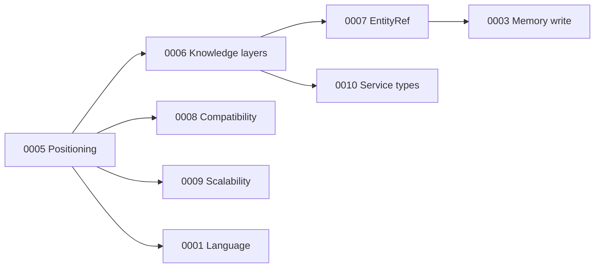

# Architecture Decision Records — Index

**Проект:** MCP-Proxmox — AI Infrastructure Operator для Proxmox VE  
**Обновлено:** 2026-06-03

---

## Статусы

| Статус | Значение |
|--------|----------|
| proposed | На обсуждении |
| accepted | Принято, нормативно |
| deprecated | Заменено другим ADR |
| superseded | См. ссылку на новый ADR |

---

## Индекс ADR

| ID | Название | Статус | Зависимости | Связь с ARCHITECTURE |
|----|----------|--------|-------------|----------------------|
| [0001](0001-implementation-language.md) | Язык реализации (Python 3.12+) | **accepted** | — | [IMPLEMENTATION_PACKAGE](../phase-1a/reports/IMPLEMENTATION_PACKAGE.md) |
| [0002](0002-mcp-transport.md) | Primary MCP transport (stdio Phase 1A) | **accepted** | 0001 | §3.2 ARCHITECTURE |
| [0003](0003-memory-write-in-read-only.md) | Запись Knowledge в режиме READ_ONLY | proposed | 0006, 0007 | §5.1, Memory |
| [0004](0004-network-scope.md) | Объём Network subsystem (SDN vs classic) | proposed | 0008 | §1.3, §8 |
| **0005** | [0005-ai-proxmox-operator-positioning.md](0005-ai-proxmox-operator-positioning.md) | **accepted** | — | §1 целиком |
| **0006** | [0006-two-level-knowledge-model.md](0006-two-level-knowledge-model.md) | **accepted** | 0005 | §1.5, Memory doc |
| **0007** | [0007-entityref.md](0007-entityref.md) | **accepted** | 0006 | EntityRef, §6 |
| **0008** | [0008-pve-compatibility-matrix.md](0008-pve-compatibility-matrix.md) | **accepted** | 0005 | Compatibility § |
| **0009** | [0009-scalability-limits.md](0009-scalability-limits.md) | **accepted** | 0005 | Scalability §, Orchestrator |
| **0010** | [0010-service-type-taxonomy.md](0010-service-type-taxonomy.md) | **accepted** | 0006 | Service Layer |
| 0011 | Backup subsystem scope (v1 read) | proposed | 0008 | §1.3 Backup |
| 0012 | Knowledge graph traversal API | proposed | 0006, 0007 | Diagnostic playbooks |

---

## Порядок принятия (рекомендуемый)

**Блокируют Memory & Knowledge Model:** 0005, 0006, 0007 (приняты в черновиках ниже).  
**Отражены в ARCHITECTURE v0.2:** 0005–0010.

---

## Отклонённые направления (не оформлять ADR)

- Provider-agnostic framework / Adapter Interface для сторонних гипервизоров  
- Объединение LXC+VM в Workload  
- Переименование `pve_*` → `infra_*`  
- Multi-repo core/provider split  

*Зафиксировано в Review Report и решении 2026-06-03.*

---

## Шаблон нового ADR

См. [template.md](template.md).

---

## Phase 1A

- [IMPLEMENTATION_PACKAGE.md](../phase-1a/reports/IMPLEMENTATION_PACKAGE.md)  
- [PHASE_1A_TASK_PLAN.md](../phase-1a/reports/PHASE_1A_TASK_PLAN.md)  
- Следующая задача: **T-004** (скелет репозитория)
