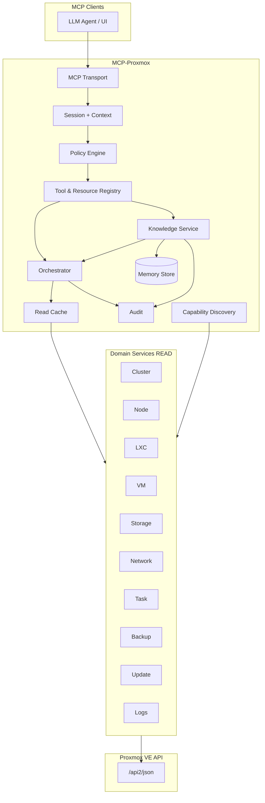
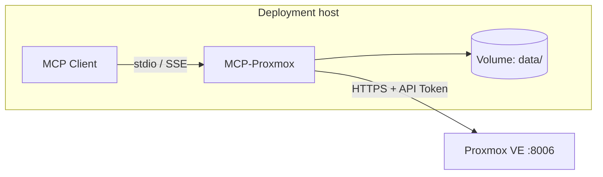
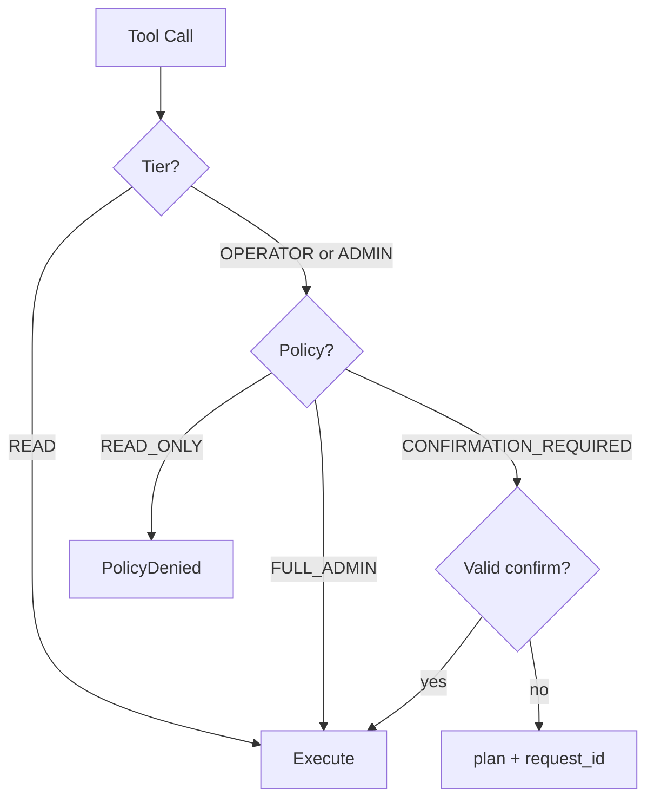

# MCP-Proxmox: AI Infrastructure Operator для Proxmox VE

**Версия документа:** 0.2  
**Статус:** Accepted — архитектура верхнего уровня  
**Дата:** 2026-06-03  
**Аудитория:** администраторы Proxmox VE, разработчики MCP, интеграторы LLM-интерфейсов  

**Нормативные документы проекта:**

| Документ | Назначение |
|----------|------------|
| [MEMORY_KNOWLEDGE_MODEL.md](MEMORY_KNOWLEDGE_MODEL.md) v1.0 | Память, Knowledge, Service, EntityRef, traverse, reconcile |
| [adr/ADR_INDEX.md](../adr/ADR_INDEX.md) | Индекс архитектурных решений (ADR) |
| [IMPLEMENTATION_ROADMAP.md](../releases/IMPLEMENTATION_ROADMAP.md) v1.0 | Фазы реализации, MVP, порядок сборки |

> Этот документ — **единственный** актуальный архитектурный документ верхнего уровня по runtime и MCP. Детали Memory/Knowledge **не дублируются** здесь — см. MEMORY_KNOWLEDGE_MODEL.md.

---

## 1. Контекст и цели

### 1.1 Назначение

**MCP-Proxmox** — MCP-сервер (Model Context Protocol), реализующий **AI Infrastructure Operator для Proxmox VE**: специализированного помощника с функциями **системного администратора** инфраструктуры на базе Proxmox (наблюдение, диагностика; в последующих релизах — контролируемые действия через Policy Engine).

Оператор предоставляет LLM-агентам структурированный, безопасный и объяснимый доступ к состоянию Proxmox и к **локальной модели знаний** (сервисы, заметки, связи).

### 1.2 Позиционирование (ADR-0005)

| Проект **является** | Проект **не является** |
|---------------------|-------------------------|
| AI-оператором для **Proxmox VE** (единственная платформа v1) | Universal Infrastructure Operator Framework |
| Open-source продуктом с **Proxmox-native** доменной моделью | Provider-agnostic / multi-hypervisor платформой |
| **Instance-agnostic**: любая инсталляция PVE | Привязкой к конкретному кластеру пользователя |
| MCP-сервером с namespace `pve_*` / `pve://` | Заменой PVE API или внешним мониторингом |

**Не задаётся в конфигурации:** число нод, размер кластера, имена VM/CT, перечень сервисов, сценарии использования. Топология и inventory определяются через **PVE API** при подключении.

### 1.3 Ограничения релиза v1 (продукт)

| Параметр | Значение |
|----------|----------|
| Режим PVE API | **Только чтение** (tier READ); мутации PVE — Phase 5+ ([ROADMAP](../releases/IMPLEMENTATION_ROADMAP.md)) |
| Подключение | Один logical endpoint PVE (`https://host:8006`); топология **N ≥ 1** нод (standalone или cluster) |
| Аутентификация | API Token (`PVEAPIToken`) |
| Policy по умолчанию | `READ_ONLY` |
| Платформа | Proxmox VE 8.x / 9.x — см. §10 Compatibility Matrix |

### 1.4 Нефункциональные требования

- **Безопасность по умолчанию:** минимальные привилегии токена; READ_ONLY на уровне Policy.  
- **Наблюдаемость:** структурированные логи, correlation id (MCP → PVE).  
- **Идемпотентность read:** TTL-кэш для тяжёлых list/get.  
- **Масштабируемость:** пагинация, fan-out с лимитами (§9).  
- **Версионирование контракта:** Semver MCP-сервера; версии tools в Registry.  
- **Документированность:** ADR, CHANGELOG, TOOL_CATALOG.

---

## 2. Модель знаний оператора

Двухуровневая модель (ADR-0006). **Полная спецификация:** [MEMORY_KNOWLEDGE_MODEL.md](MEMORY_KNOWLEDGE_MODEL.md).

### 2.1 Infrastructure Layer (Proxmox-native)

Источник истины — **PVE API**. Сущности и domain-подсистемы:

| Сущность | Domain / подсистема | Назначение (кратко) |
|----------|---------------------|---------------------|
| **Cluster** | cluster | Кворум, summary, datacenter scope |
| **Node** | nodes | Ноды, ресурсы, версия |
| **LXC** | containers | Контейнеры LXC |
| **VM** | vms | Виртуальные машины QEMU/KVM |
| **Storage** | storage | Storage pools, content, usage |
| **Network** | network | Bridge, iface, SDN, firewall (read) |
| **Task** | tasks | Задачи PVE (UPID) |
| **Backup** | backup | Backup jobs / snapshots (при capability) |
| **Update** | updates | Репозитории, версии, pending updates |

**Наблюдаемость (cross-cutting):** подсистема **Logs** (syslog/journal через API) — не отдельный kind EntityRef, а domain READ tools.

LXC и VM — **раздельные** сущности (не объединяются в Workload).

### 2.2 Service Layer (Operator Memory)

Источник истины — **локальная Memory**. Сущность **Service**:

| Поле | Описание |
|------|----------|
| **Name** | Имя инстанса (задаёт пользователь/агент) |
| **Type** | Категория из словаря ADR-0010 (не имя продукта) |
| **RunsOn** | EntityRef → `lxc` или `vm` |
| **Dependencies** | Список EntityRef (Service и/или Infrastructure) |
| **HealthStatus** | `unknown`, `healthy`, `degraded`, `unhealthy`, `maintenance` |
| **Metadata** | Опциональные KV (без нормативных product/vendor в схеме) |

**Диагностическая цепочка (нормативная):**

`Service → (LXC | VM) → Node → Cluster`

Детали traverse, reconcile, MCP tools Knowledge — в [MEMORY_KNOWLEDGE_MODEL.md](MEMORY_KNOWLEDGE_MODEL.md).

### 2.3 EntityRef (ADR-0007)

Единый идентификатор ссылок в Memory, Dependencies, Audit.

- Формат гостя: `id = {nodename}:{vmid}` для `lxc` / `vm`.  
- URI: `pve://ref/{layer}/{kind}/{id}?cluster={cluster_id}`.  
- При исчезновении объекта из PVE: `stale=true`, текст записей не удаляется.

Каноническое описание: MEMORY §4.

---

## 3. Архитектура MCP-сервера

### 3.1 Высокоуровневая схема



### 3.2 Слои ответственности

| Слой | Ответственность |
|------|-----------------|
| **Transport** | MCP JSON-RPC; stdio (v1 приоритет), SSE (см. ADR-0002) |
| **Session** | session id, policy mode, actor, correlation id |
| **Policy Engine** | tier + policy mode; единая точка для mutate (v2+) |
| **Registry** | tools / resources / prompts + metadata tier |
| **Orchestrator** | fan-out по нодам inventory, pagination, partial results |
| **Capability Discovery** | runtime flags ADR-0008 → graceful degrade |
| **Domain Services** | маппинг PVE API по подсистеме; один модуль на домен |
| **PVE Client** | HTTPS, token, retry, `PveApiError` |
| **Cache** | TTL list/get; настраиваемый per-tool |
| **Knowledge Service** | Memory, EntityRef, Service, reconcile, traverse |
| **Memory Store** | SQLite `data/operator_memory.db` |
| **Audit** | append-only JSON-lines |

**Границы:** `domains/*` не импортируют друг друга; общение через Orchestrator и `pve/client`. Knowledge Service вызывает Domains для live state, не дублирует PVE SoT.

### 3.3 Поверхности MCP

#### Tools

Именование: `pve_<subsystem>_<action>`. Группировка по **tier** (§6) и подсистеме.

Полный перечень по фазам: [IMPLEMENTATION_ROADMAP.md](../releases/IMPLEMENTATION_ROADMAP.md); снимок контракта: `TOOL_CATALOG.md` (генерируется при сборке).

#### Resources (URI)

| URI | Назначение |
|-----|------------|
| `pve://cluster/summary` | Snapshot кластера |
| `pve://node/{name}/status` | Статус ноды |
| `pve://ref/{layer}/{kind}/{id}?cluster=` | EntityRef (MEMORY §4.4) |
| `pve://memory/records`, `pve://memory/services` | Индексы Memory |
| `pve://adr/{id}` | Текст ADR |

Запись в PVE через MCP в v1 **не выполняется**. Запись в локальную Memory — tools Knowledge (политика §7, ADR-0003).

#### Prompts

Опционально с v1.0 / v1.1 (например `diagnose_service`). Не блокируют Phase 1A.

### 3.4 Взаимодействие с Proxmox API

- **URL:** `https://<host>:8006/api2/json`  
- **Auth:** `Authorization: PVEAPIToken=USER@REALM!TOKENID=SECRET`  
- **Маршрутизация:** node-local endpoints → target node; cluster-wide — без привязки к ноде.  
- **Ошибки:** `PveApiError` (HTTP, body PVE, node).  
- **Concurrency:** см. §9 (`max_concurrent_per_node`, `max_concurrent_cluster`).

### 3.5 Развёртывание



- Рекомендуется: контейнер + `docker-compose`, secrets через env / Docker secrets.  
- Интеграция с LLM UI (например Open WebUI) — **пример** в `deploy/`; не требование архитектуры.  
- Секреты не в образе: `PVE_HOST`, token, `PVE_POLICY_MODE`.

### 3.6 Расширяемость (без переписывания ядра)

1. Новая Infrastructure-подсистема → domain-модуль + Registry + TOOL_CATALOG.  
2. Новый tier OPERATOR/ADMIN → Policy + `PveClient.mutate()` (Phase 5+).  
3. Новая policy mode → конфиг + enum.  
4. Deprecation tools → поле `version` в descriptor, N релизов поддержки.

---

## 4. Структура проекта

Монорепозиторий (язык — ADR-0001, proposed):

```
MCP-Proxmox/
├── docs/
│   ├── ARCHITECTURE.md              # этот документ
│   ├── MEMORY_KNOWLEDGE_MODEL.md
│   ├── IMPLEMENTATION_ROADMAP.md
│   ├── TOOL_CATALOG.md
│   ├── OPERATIONS.md
│   └── adr/ADR_INDEX.md
├── deploy/
├── config/
├── src/
│   ├── main/
│   ├── mcp/{transport,registry,session,handlers}/
│   ├── policy/
│   ├── pve/{client,auth,capabilities,models}/
│   ├── orchestrator/
│   ├── domains/{cluster,nodes,containers,vms,storage,network,tasks,backup,updates,logs}/
│   ├── knowledge/{entityref,service,traverse,reconcile}/
│   ├── memory/store/
│   ├── cache/
│   └── audit/
├── data/                            # gitignored
└── tests/{unit,contract,integration}/
```

Реализация по фазам: [IMPLEMENTATION_ROADMAP.md](../releases/IMPLEMENTATION_ROADMAP.md) (старт — **Phase 1A**).

---

## 5. Capability Discovery (ADR-0008)

При старте (или первом запросе) фиксируется набор **capabilities**:

| Capability | Влияние |
|------------|---------|
| `cluster_mode` | standalone (N=1) vs multi-node |
| `sdn` | Network SDN tools |
| `backup_api` | Backup domain tools |
| `ceph` | подсказки по storage subtype |

Если capability недоступна: tool возвращает **`CapabilityUnavailable`**, не fatal для сервера. Memory reconcile пропускает соответствующие refs (MEMORY §7.5).

**Поддержка PVE:** Tier 1 — 9.x; Tier 2 (best effort) — 8.x; 7.x — вне scope. Детали: [ADR-0008](../adr/0008-pve-compatibility-matrix.md).

---

## 6. Уровни инструментов (Tool Tiers)

Tier — **опасность** операции; policy mode — **что разрешено** (§7).

### 6.1 READ

Наблюдение и локальная Memory (без мутации PVE).

| Подсистема | Примеры tools |
|------------|---------------|
| Cluster | `pve_cluster_status`, `pve_cluster_resources`, `pve_cluster_overview` |
| Node | `pve_nodes_list`, `pve_node_status` |
| LXC | `pve_lxc_list`, `pve_lxc_config`, `pve_lxc_status`, `pve_lxc_rrddata` |
| VM | `pve_qemu_list`, `pve_qemu_config`, `pve_qemu_status`, `pve_qemu_rrddata` |
| Storage | `pve_storage_list`, `pve_storage_status`, `pve_storage_content` |
| Network | `pve_network_interfaces`, `pve_sdn_status`, `pve_firewall_rules_list` |
| Task | `pve_tasks_list`, `pve_task_status`, `pve_task_log` |
| Logs | `pve_syslog`, `pve_journal` |
| Update | `pve_updates_list`, `pve_repositories_get`, `pve_versions` |
| Backup | `pve_backup_list`, `pve_backup_job_status`, … |
| Knowledge | `pve_memory_*`, `pve_service_*`, `pve_knowledge_*`, `pve_adr_*` |

В v1 продукте для PVE — только tier **READ** зарегистрирован и активен.

### 6.2 OPERATOR (план, Phase 5)

Lifecycle, snapshot, migrate, backup trigger — см. ROADMAP Phase 5.

### 6.3 ADMIN (план, Phase 6)

CRUD гостей, storage, network, upgrade — см. ROADMAP Phase 6.

### 6.4 Матрица tier × подсистема

| Подсистема | READ | OPERATOR | ADMIN |
|------------|------|----------|-------|
| Cluster | ✓ | — | план |
| Node | ✓ | maint | join/leave |
| LXC | ✓ | lifecycle | CRUD |
| VM | ✓ | lifecycle | CRUD |
| Storage | ✓ | scan/snap | CRUD |
| Network | ✓ | apply | CRUD SDN |
| Task | ✓ | stop | — |
| Logs | ✓ | — | — |
| Update | ✓ | dist-upgrade | repo |
| Backup | ✓ | trigger | config |
| Knowledge | read + local write* | — | export |

\*Локальная Memory; ADR-0003.

---

## 7. Система политик доступа

### 7.1 Policy modes

| Mode | Поведение |
|------|-----------|
| **READ_ONLY** | Только `tier=READ`. OPERATOR/ADMIN → `PolicyDenied`. Memory write — если `memory.allow_write` (ADR-0003). **Default.** |
| **CONFIRMATION_REQUIRED** | READ + plan/execute для mutate (Phase 5) |
| **FULL_ADMIN** | Все зарегистрированные tools; отдельный PVE token; audit обязателен |

Режим: `PVE_POLICY_MODE` при старте.

### 7.2 Policy mode × tier



### 7.3 Двухфазное подтверждение (Phase 5)

`pve_operator_plan` → подтверждение → `pve_operator_execute`; планы в `data/pending/` с TTL.

### 7.4 PVE token (периметр)

| Policy | Минимальные привилегии |
|--------|------------------------|
| READ_ONLY | Audit/Monitor роли (Datastore, Sys, VM, SDN — по включённым domains) |
| Mutate | Отдельный token с PowerMgmt/Config по каталогу tool |

### 7.5 Audit

`audit.log` (JSON lines): timestamp, session, tool, tier, policy_mode, entity refs, outcome.

---

## 8. Knowledge и Memory

**Нормативная спецификация:** [MEMORY_KNOWLEDGE_MODEL.md](MEMORY_KNOWLEDGE_MODEL.md) v1.0.

В ARCHITECTURE фиксируется только место в системе:

| Аспект | Решение |
|--------|---------|
| Хранилище | SQLite, `schema_version=1.0`, volume `data/` |
| SoT | Service и enrichment — Memory; Infrastructure state — PVE |
| Компонент | Knowledge Service (§3.2) |
| Ключевые операции | resolve, search, Service CRUD, traverse, reconcile |
| Идентификация | EntityRef (§2.3) |
| Диагностика | `pve_knowledge_traverse` + playbook MEMORY §8 |

Запись в Memory при `READ_ONLY` не является мутацией PVE (ADR-0003, proposed).

---

## 9. Scalability & Limits (ADR-0009)

| Тема | Требование |
|------|------------|
| **Топология** | N ≥ 1 нод; discovery через API, не конфиг |
| **List tools** | `limit` (default 100, max 1000), `offset` |
| **Fan-out** | `max_concurrent_per_node` default 5; `max_concurrent_cluster` default 15; timeout per node |
| **Partial failure** | `partial_results` + `errors[]` при недоступной ноде |
| **Aggregate** | `pve_cluster_overview`, `pve_guests_list_all`: summary; `truncated` если inventory > `aggregate_threshold` (default 500) |
| **Traverse** | max 64 nodes; max 16 parallel PVE reads (MEMORY §8) |
| **Memory search** | default limit 20, max 100 |
| **Logs** | `max_lines` default 500, max 5000 |

Детали и обоснование: [ADR-0009](../adr/0009-scalability-limits.md).

---

## 10. Compatibility Matrix (ADR-0008)

| Proxmox VE | Статус |
|------------|--------|
| **9.x** | Tier 1 — полное покрытие READ v1 |
| **8.x** | Tier 2 — best effort, CI по возможности |
| **7.x** | Не поддерживается |

| Компонент | Версионирование |
|-----------|-----------------|
| MCP-сервер | Semver, git tags, CHANGELOG |
| PVE API path | `/api2/json` |
| Memory schema | `1.0` (MEMORY §12) |

Breaking changes — CHANGELOG + метки issue `pve-8` / `pve-9`.

---

## 11. Документация, ADR, история

### 11.1 ADR

Каталог `docs/adr/`; индекс: [ADR_INDEX.md](../adr/ADR_INDEX.md). Принятые: **0005–0010** (позиционирование, knowledge, EntityRef, compatibility, scalability, Service types).

Доступ из MCP: `pve_adr_list`, `pve_adr_get`, resource `pve://adr/{id}`.

### 11.2 CHANGELOG и Tool Catalog

- `CHANGELOG.md` — [Keep a Changelog](https://keepachangelog.com/).  
- `TOOL_CATALOG.md` — tool, tier, subsystem, PVE endpoints, limits.

### 11.3 Операционная история

| Источник | Содержание |
|----------|------------|
| PVE Tasks | Факты изменений в кластере |
| MCP Audit | Вызовы tools и policy |
| Memory `incident` | Интерпретация оператора |
| ADR | Архитектурные решения |

---

## 12. Безопасность и конфигурация

### 12.1 Угрозы

| Угроза | Митигация |
|--------|-----------|
| Утечка token | secrets вне repo; ротация |
| Опасный tool | Policy + отсутствие mutate в v1 |
| Prompt injection в Memory | не исполнять shell из `body_md` |
| SSRF | фиксированный `PVE_HOST` в конфиге |
| Секреты в Memory | не хранить пароли/ключи (MEMORY §11) |

### 12.2 Пример конфигурации

```yaml
connection:
  id: "dc-prod"              # cluster_id для Memory
  host: "https://pve.example.local:8006"
  token_id: "${PVE_TOKEN_ID}"
  token_secret: "${PVE_TOKEN_SECRET}"
  verify_ssl: true

policy:
  mode: READ_ONLY
  memory:
    allow_write: true

orchestrator:
  max_concurrent_per_node: 5
  max_concurrent_cluster: 15
  node_request_timeout_sec: 30
  aggregate_threshold: 500

cache:
  cluster_resources_ttl_sec: 30
  node_status_ttl_sec: 15

subsystems:
  logs:
    enabled: true
    max_lines: 500
```

---

## 13. Реализация и релизы

План разработки, MVP, Phase 1A–6, task list: **[IMPLEMENTATION_ROADMAP.md](../releases/IMPLEMENTATION_ROADMAP.md)**.

| Веха | Ориентир | Содержание |
|------|----------|------------|
| Early MVP | Phase 1A | MCP + Cluster/Node/LXC/VM READ |
| Infrastructure READ | Phase 1B | Все domains + capabilities |
| Public v1.0.0 | Phase 4 | + Knowledge, Service, traverse |
| Controlled mutate | Phase 5 | OPERATOR + CONFIRMATION |
| Advanced | Phase 6 | ADMIN, расширения |

**Следующий шаг разработки:** Phase 1A (ROADMAP §13.1, tasks T-100…T-117).

---

## 14. Открытые ADR (proposed)

| ADR | Тема |
|-----|------|
| [0001](../adr/0001-implementation-language.md) | Язык реализации |
| [0002](../adr/0002-mcp-transport.md) | stdio vs SSE |
| [0003](../adr/0003-memory-write-in-read-only.md) | Memory write в READ_ONLY |
| [0004](../adr/0004-network-scope.md) | Network / SDN scope |
| [0011](../adr/ADR_INDEX.md) | Backup subsystem scope |
| [0012](../adr/ADR_INDEX.md) | Traversal API (детализация) |

Не блокируют старт Phase 1A при разумных defaults (stdio, allow_write=true).

---

## 15. Резюме

MCP-Proxmox — **слоистый MCP-сервер** для **Proxmox VE** с **Policy Engine**, **Orchestrator** (N нод без зашитого размера), **Capability Discovery**, **Domain Services** по Infrastructure Layer и **Knowledge Service** по Service Layer. Релиз v1 — **READ_ONLY** к PVE; Memory и диагностика `Service → Cluster` — по [MEMORY_KNOWLEDGE_MODEL.md](MEMORY_KNOWLEDGE_MODEL.md). Реализация — по [IMPLEMENTATION_ROADMAP.md](../releases/IMPLEMENTATION_ROADMAP.md).

**Архитектурная фаза документации:** завершена с v0.2.

---

## 16. Documentation Consistency Report

Отчёт о синхронизации **ARCHITECTURE.md v0.2** с MEMORY v1.0, ROADMAP v1.0 и ADR 0005–0010.

### 16.1 Изменённые / новые разделы

| Раздел | Действие |
|--------|----------|
| Заголовок, статус, ссылки на нормативные docs | Обновлён |
| §1 Контекст | Переписан: AI Operator, ADR-0005, instance-agnostic |
| §2 Модель знаний | **Новый** — Infrastructure + Service, EntityRef кратко |
| §3 Архитектура MCP | Диаграмма: Knowledge Service, Backup, Capabilities; без «VE 9 only» |
| §4 Структура проекта | `knowledge/`, `backup/`, ссылки на ROADMAP |
| §5 Capability Discovery | **Новый** — ADR-0008 |
| §6 Tool tiers | +Backup, +Knowledge; матрица расширена |
| §7 Policy | Сохранён; привязка к Phase 5 |
| §8 Knowledge | **Заменён** бывший §6 Memory — только отсылка к MEMORY |
| §9 Scalability | **Новый** — ADR-0009 |
| §10 Compatibility | **Новый** — ADR-0008 |
| §11 Документация | ADR_INDEX, без homelab в истории |
| §12 Безопасность | Пример `pve.example.local` |
| §13 Реализация | Ссылка на ROADMAP вместо встроенной roadmap v0.1 |
| §14 Открытые ADR | Обновлён список |
| §16 Этот отчёт | **Новый** |

### 16.2 Удалённые или выведенные из ARCHITECTURE

| Было (v0.1) | Причина |
|-------------|---------|
| «Домашний кластер», «Proxmox VE 9» как единственная версия | ADR-0005, 0008; instance-agnostic |
| «3 ноды» в §1.2 и Orchestrator | ADR-0009, C-05 |
| «3–5 parallel» homelab | §9 Scalability, конфиг |
| §6 Memory (таблицы, SQLite DDL, примеры Home Assistant, ZFS) | Дублирование MEMORY v1.0 |
| `pve.homelab.local` | Конкретная инфраструктура |
| «ваш homelab» в тексте Memory | Конкретная инсталляция |
| Дорожная карта v1.0/v1.1/v2.0 inline §10 | Дублирование IMPLEMENTATION_ROADMAP |
| Footer «ADR-0001, mock tests» | Заменён ROADMAP Phase 1A |
| `memory/` embeddings в v1 structure | Phase 6 / EXP в ROADMAP |
| `pve://memory/notes` только | Расширено URI из MEMORY |
| OPERATIONS «homelab» в описании tree | Нейтральное OPERATIONS.md |

### 16.3 Исключённые устаревшие / отменённые решения

| Решение | Статус |
|---------|--------|
| Universal Infrastructure Operator Framework | Отменено ADR-0005 |
| Provider adapter / `infra_*` namespace | Отменено (Review + ADR-0005) |
| Workload вместо LXC+VM | Отменено ADR-0005/0006 |
| Фиксированное число нод | Отменено ADR-0009 |
| Встроенный каталог продуктов в Service | Отменено ADR-0010 |
| Multi-repo core/provider | Не принималось |

### 16.4 Проверка согласованности

| Проверка | Результат |
|----------|-----------|
| **ADR-0005** (Proxmox-only AI operator) | ✓ §1.2, §2, нет framework |
| **ADR-0006** (два уровня знаний) | ✓ §2; детали в MEMORY |
| **ADR-0007** (EntityRef) | ✓ §2.3, §8; URI §3.3 |
| **ADR-0008** (compatibility, capabilities) | ✓ §5, §10 |
| **ADR-0009** (scalability) | ✓ §9; traverse лимиты согласованы с MEMORY §8 |
| **ADR-0010** (Service.Type) | ✓ §2.2; детали в MEMORY |
| **MEMORY v1.0** | ✓ Нет противоречий; ARCHITECTURE не дублирует схемы |
| **ROADMAP v1.0** | ✓ §13, Phase 1A; tiers OPERATOR/ADMIN = Phase 5–6 |
| **ADR-0003** (proposed) | ✓ §7.1, §8 — явно proposed |
| **ADR-0001/0002** (proposed) | ✓ §3.2, §14 — не блокируют трактовку |

### 16.5 Оставшиеся противоречия

**Нормативных противоречий между ARCHITECTURE v0.2, MEMORY v1.0, ROADMAP v1.0 и ADR 0005–0010 не выявлено.**

| Элемент | Характер | Действие при реализации |
|---------|----------|-------------------------|
| ADR-0001, 0002, 0003, 0004 | proposed | Закрыть до или в ходе Phase 1A–2 |
| ADR-0011, 0012 | proposed в INDEX | Уточнить Backup/traverse при Phase 1B/4 |
| `docs/recommendations/ARCHITECTURE_UPDATE_RECOMMENDATIONS.md` | исторический черновик | Не нормативен; можно архивировать |
| `ARCHITECTURE.md` v0.1 в git history | superseded | v0.2 — актуальная версия |

### 16.6 Завершение архитектурной фазы

Документация согласована. **Разрешён переход к реализации Phase 1A** согласно [IMPLEMENTATION_ROADMAP.md](../releases/IMPLEMENTATION_ROADMAP.md) (tasks T-000…T-117).

---

*Конец документа ARCHITECTURE.md v0.2.*
