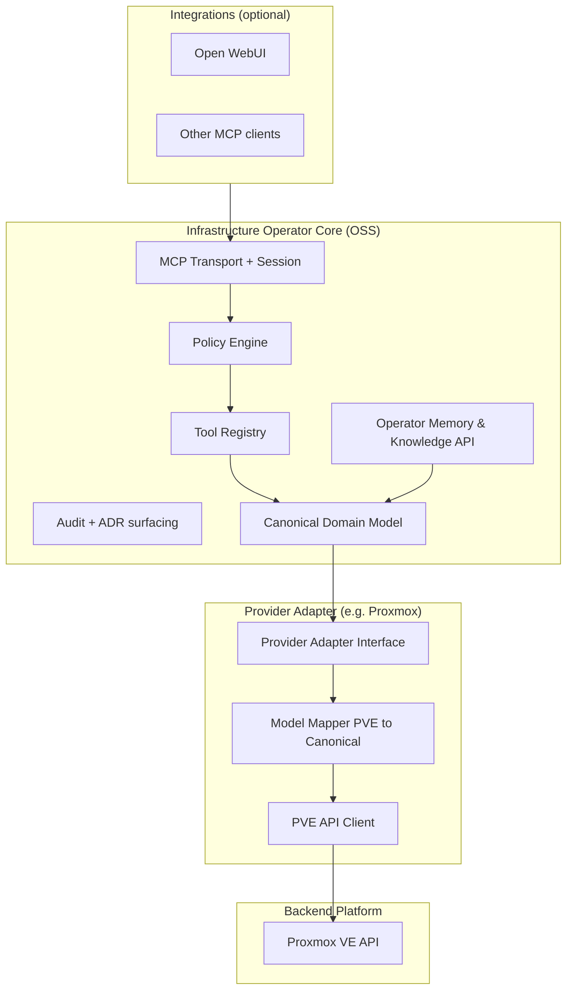

> **Archived.** Исторический документ. Superseded by [ARCHITECTURE.md](../../architecture/ARCHITECTURE.md) v0.2 и ADR 0005–0010.

# Architecture Review Report: MCP-Proxmox / Infrastructure Operator

**Документ-объект ревью:** `docs/ARCHITECTURE.md` v0.1  
**Дата ревью:** 2026-06-03  
**Роль ревьюера:** независимый архитектор (pre-work для *Infrastructure Memory & Knowledge Model*)  
**Статус:** Review Report — **без правок** исходного ARCHITECTURE.md  
**Цель:** оценить пригодность архитектуры к публикации как **open-source** и к эволюции в **универсальный Infrastructure Operator**

---

## Executive Summary

Текущий `ARCHITECTURE.md` — сильный **product-specific** чертёж для homelab на **Proxmox VE 9** с интеграцией **Open WebUI**. Слои **Policy Engine**, **Tool Registry**, **tier/policy separation**, **Operator Memory** и **ADR** — переносимы и пригодны для OSS-ядра.

Однако документ **не декларирует** границу между:

- **универсальным ядром** (Infrastructure Operator Framework), и  
- **адаптером платформы** (Proxmox Provider).

Большая часть публичного контракта (имена tools, URI-схема, структура `src/`, диаграммы, примеры конфигурации) **жёстко привязана к PVE**. Для OSS это создаёт риск: вкладчики и потребители воспримут проект как «MCP для Proxmox», а не как оператор с plug-in моделью.

**Вердикт:** архитектура **расширяема внутри Proxmox** (v2 OPERATOR/ADMIN без переписывания доменов), но **не универсальна на уровне документа и контракта**. Для open-source публикации требуется слой абстракций и разделение репозиториев/пакетов — см. §6–7.

**Оценка готовности к OSS (только по документу):**

| Критерий | Оценка | Комментарий |
|----------|--------|-------------|
| Модульность runtime | 7/10 | Domain-модули + policy отделены |
| Нейтральность контракта MCP | 3/10 | Префикс `pve_`, URI `pve://` |
| Масштабируемость (N нод) | 6/10 | Orchestrator задуман, но зашиты homelab-константы |
| Документация для сторонних платформ | 2/10 | Нет Provider/Adapter model |
| Memory/Knowledge | 6/10 | Хорошая идея, entity model = PVE ids |
| Governance (ADR, changelog) | 8/10 | OSS-friendly |

---

## 1. Зависимости от конкретной платформы

Ниже — исчерпывающий реестр привязок к продукту, версии, стеку или инфраструктуре, найденных в документе.

### 1.1 Платформа виртуализации / оркестрации

| Место в документе | Привязка | Риск для OSS |
|-------------------|----------|--------------|
| Заголовок, §1.1 | **Proxmox VE 9**, «MCP-Proxmox» | Бренд и scope зафиксированы в названии |
| §1.3 подсистемы | **LXC**, **QEMU**, **SDN**, **PVE Tasks**, **vmid** | Нет термина Workload/Guest |
| §2.1 диаграмма | Блок `Proxmox VE 9`, `PVE REST API` | External = только PVE |
| §2.2 | **PVE Client**, `PveApiError`, маппинг **PVE API** | Нет Infrastructure Provider Client |
| §2.4 | URL `:8006/api2/json`, заголовок **PVEAPIToken** | Конкретный API contract |
| §2.4 | **node-local vs cluster-wide** endpoints | Модель PVE, не общая |
| §4.x | Tools `pve_lxc_*`, `pve_qemu_*`, `pve_sdn_*` | Публичный API = PVE |
| §5.4 | Привилегии **Datastore.Audit**, **VM.Audit**, … | RBAC Proxmox |
| §7.3, §8 | **PVE Tasks API**, RRD, apt/changelog | Операционная модель PVE |
| §9.3 | Секция конфига `pve:` | Provider в корне конфига |

### 1.2 Версия продукта

| Место | Привязка |
|-------|----------|
| Весь документ | **VE 9** в заголовке и диаграмме — не «9+» и не «supported versions matrix» |
| §8 Updates | apt, repositories — модель пакетного менеджера Debian/PVE |

*Замечание:* отсутствует политика совместимости (PVE 8 vs 9, deprecated API fields).

### 1.3 Конкретный стек и инструменты

| Место | Привязка | Универсальное ядро? |
|-------|----------|---------------------|
| §1.1, §2.5 | **Open WebUI** как primary UI | Нет — это Integration, не Core |
| §2.5, §3 | **Docker**, **docker-compose**, SSE на localhost | Деплой-паттерн homelab |
| §6.2 | **SQLite** (рекомендация v1) | Допустимо как default backend |
| §6.5 | **Open WebUI Knowledge** | Интеграция |
| §3 scripts | `generate-tool-catalog.py` | Язык не зафиксирован в ADR, но путь намекает Python |
| §11 ADR-0001 | Python vs TypeScript | Стек открыт, но не абстрагирован |

### 1.4 Конкретная инфраструктура и эксплуатация

| Место | Привязка |
|-------|----------|
| §1.1 | **домашний кластер**, **homelab** |
| §1.2 | **3 ноды**, единый Proxmox Cluster |
| §2.5 | «Docker host / homelab» |
| §6, §7.3 | **ZFS**, **GPU passthrough**, **Home Assistant** в примерах |
| §9.3 | `pve.homelab.local` |
| §3 OPERATIONS.md | runbook для homelab |

### 1.5 Протокол и нейминг MCP

| Место | Привязка |
|-------|----------|
| §2.3 | Префикс tools: `pve_<subsystem>_<action>` |
| §2.3 | URI: `pve://...` |
| §6.3, §7.1 | `pve_memory_*`, `pve://adr/{id}` |
| §5.3 | `pve_operator_plan`, `pve_operator_execute` |

**Вывод §1:** универсальность заявлена в §1.4 («расширяемость») и §2.6 только **внутри экосистемы Proxmox**. Платформенная нейтральность **не является явным архитектурным принципом** документа.

---

## 2. Зависимости от масштаба инфраструктуры

### 2.1 Явные ограничения масштаба

| Место | Предположение | Последствие |
|-------|---------------|-------------|
| §1.2 | **Ровно 3 ноды** | Читатель закрепляет размер кластера |
| §2.2 Orchestrator | «Скрывает топологию **3 нод**» | Алгоритм агрегации не обобщён на N |
| §2.4 Rate limiting | «**3–5** параллельных» для домашнего кластера | Нет формулы от N, latency budget |
| §9.3 cache TTL | 30s / 15s без привязки к размеру inventory | На 500 VM может быть недостаточно/избыточно |

### 2.2 Неявные предположения о масштабе и нагрузке

| Область | Неявное предположение |
|---------|------------------------|
| §8 `pve_cluster_overview` | Один агрегирующий вызов уместен — **малый** inventory |
| §8 `pve_guests_list_all` | Полный список LXC+QEMU в памяти агента |
| Cache | TTL-кэш без pagination/streaming policy |
| Logs §8 | tail до 500 строк — homelab объёмы |
| Tasks | «recent» без курсоров/лимитов на большие кластеры |
| Memory reconciliation | Периодический full sync приемлем |

### 2.3 Тип нагрузки

| Место | Предположение |
|-------|---------------|
| §4.2 OPERATOR | VM/CT lifecycle, snapshot, migrate — **виртуализация**, не K8s pods |
| §6 примеры | IoT/home automation (Home Assistant), GPU passthrough — **consumer/homelab** |
| §4.3 ADMIN | datacenter options — модель **централизованного virt cluster** |

### 2.4 Отсутствующие масштабные требования (gap для OSS)

- Нет SLO для размера inventory (VM count, storage objects).  
- Нет стратегии **pagination**, **sharding by node**, **fan-out limits**.  
- Нет режима **single-node** PVE (не cluster) vs multi-node.  
- Нет **multi-cluster** / multi-datacenter в одном operator instance.

**Вывод §2:** документ оптимизирован под **малый стабильный кластер**; N-нодная топология упомянута в Orchestrator, но **не специфицирована** как параметр. Для OSS нужен отдельный раздел *Scalability Assumptions* с явными границами.

---

## 3. Конкретные продукты вместо абстрактных сущностей

### 3.1 Реестр «продуктовых» терминов в публичном слое

| В документе | Абстракция (рекомендуемая) | Слой |
|-------------|---------------------------|------|
| Proxmox Cluster | **Fleet** / **Site** / **Cluster** | Domain |
| Node (PVE) | **Host** / **Node** | Domain |
| LXC | **Workload** (kind=container) | Domain |
| QEMU VM | **Workload** (kind=vm) | Domain |
| vmid | **Workload ID** (provider-scoped) | Identity |
| Storage pool (PVE) | **StoragePool** / **VolumeBackend** | Domain |
| SDN / bridge / firewall | **NetworkDomain** objects | Domain |
| PVE Task | **AsyncOperation** / **Job** | Domain |
| syslog/journal | **LogStream** | Domain |
| apt/updates | **PlatformMaintenance** | Domain |
| Open WebUI | **Chat UI Integration** | Integration |
| MCP-Proxmox Server | **Infrastructure Operator** (core) + **Provider Plugin** | Product |
| pve_* tools | **infra_*** или provider-qualified names | MCP contract |
| Homelab | **Deployment profile: small** | Ops |

### 3.2 Смешение уровней в одной диаграмме (§2.1)

Диаграмма объединяет:

- универсальные компоненты (Policy, Registry, Memory), и  
- PVE-специфичные домены (Containers, VMs как отдельные блоки, а не Workloads).

Для OSS читатель не видит, где заканчивается **Core** и начинается **Proxmox Adapter**.

### 3.3 Memory model (§6) — привязка к PVE identity

- `entities(entity_type, ref_id)` с примерами **vmid**, **node**, **storage id**.  
- `snapshot_bookmarks` ссылаются на `pve_cluster_resources`.  
- Нет **provider-agnostic URI** для entity (`infra://workload/...`).

Memory описана как почти универсальная, но **ключи сущностей** — PVE-native → документ для Knowledge Model потребует отдельной canonical entity model.

---

## 4. Что перенести на уровень абстракций

### 4.1 Предлагаемая целевая модель слоёв

### 4.2 Матрица: компонент → слой

| Компонент / концепция | Сейчас в документе | Целевой слой |
|----------------------|-------------------|--------------|
| Transport, Session | Core (корректно) | **Core** |
| Policy Engine, tiers, modes | Core (корректно) | **Core** |
| Tool Registry + versioning | Core | **Core** |
| Operator Memory store | Core (частично PVE refs) | **Core** + canonical entity refs |
| ADR / CHANGELOG exposure | Core | **Core** |
| Cluster, Node, Workload, Storage, Network, Job, Logs, Maintenance | PVE domains | **Canonical model** + **Provider mapping** |
| Orchestrator (multi-node fan-out) | Coupled to PVE | **Core orchestration** + provider capabilities |
| PVE Client, auth header, privileges | `pve/` | **Provider: proxmox** |
| `pve_*` tools | Public API | **Provider tool namespace** или dual registration |
| `pve://` resources | Public URI | **`infra://` canonical** + optional `proxmox://` alias |
| Open WebUI deploy, SSE preference | §2.5 | **Integration guide** |
| Docker compose | §3 deploy | **Deployment profiles** |
| Homelab 3-node | §1.2 | **Profile: small-cluster** (example only) |
| CONFIRMATION plan/execute | Core flow | **Core** (preview provider-agnostic) |
| RRD, apt, SDN | Domain detail | **Provider capability flags** |

### 4.3 Provider Adapter Interface (концептуально, без кода)

Документ должен ввести контракт адаптера с capability discovery:

- `list_nodes()`, `get_node_status()`  
- `list_workloads(filters)`, `get_workload(id)`  
- `list_storage()`, `get_storage_usage()`  
- `list_network_objects()`  
- `list_jobs()`, `get_job(id)`  
- `tail_logs(stream_ref)`  
- `list_pending_maintenance()`  
- optional: `mutate_*` для v2  

MCP tools в Core оперируют **canonical DTO**; adapter переводит в/из PVE JSON.

### 4.4 Разделение подсистем §1.3 для универсальности

| Текущая подсистема | Универсальная подсистема Core | Proxmox-specific |
|--------------------|------------------------------|------------------|
| Cluster | **Site / Cluster** | quorum, pve cluster status fields |
| Nodes | **Nodes** | subscription, pve services |
| Containers + VMs | **Workloads** (единый модуль) | lxc vs qemu mapping |
| Storage | **Storage** | datastore types (zfspool, rbd, …) |
| Network | **Network** | SDN zones |
| Tasks | **Jobs** | UPID format |
| Logs | **Observability / Logs** | journal via node API |
| Updates | **Maintenance** | apt |
| Memory | **Knowledge** | — |

---

## 5. Путь от Proxmox-оператора к универсальному Infrastructure Operator

### 5.1 Целевое позиционирование OSS

**Вариант A (monorepo):**  
`infrastructure-operator-core` + `provider-proxmox` в одном репозитории, чёткие границы пакетов.

**Вариант B (multi-repo):**  
Core OSS + Proxmox как reference implementation (рекомендуется для credibility).

Документ сейчас соответствует **single-product repo**, не framework.

### 5.2 Список стратегических изменений (без переписывания runtime сразу)

1. **Два архитектурных документа:** `CORE_ARCHITECTURE.md` (нейтральный) + `PROVIDERS/proxmox.md` (текущий контент).  
2. **Canonical Domain Model** — одна таблица сущностей и идентификаторов для Memory и tools.  
3. **Namespace policy для MCP:** core tools `infra_*`, provider tools `proxmox_*` (deprecated alias `pve_*` при миграции).  
4. **URI scheme:** `infra://cluster/{id}/summary`, provider extensions в metadata.  
5. **Configuration schema:** `providers.proxmox` вместо корневого `pve:`.  
6. **Deployment profiles:** `profiles/homelab-3-node.yaml` как **пример**, не ограничение §1.2.  
7. **Scalability appendix:** pagination, fan-out, max inventory.  
8. **Compatibility matrix:** PVE 8/9, API version pin.  
9. **Integration catalog:** Open WebUI — одна страница, не в core narrative.  
10. **OSS governance:** CONTRIBUTING, CODEOWNERS, security policy, provider plugin RFC.

### 5.3 Что можно оставить Proxmox-specific без ущерба OSS

- Первая reference implementation = Proxmox.  
- Имена внутренних модулей `domains/lxc` допустимы **внутри** `provider-proxmox`.  
- Примеры в docs/runbooks с реальными PVE терминами — в provider guide.

### 5.4 Риски при отсутствии изменений

| Риск | Влияние |
|------|---------|
| Fork только под Proxmox | Нет экосистемы провайдеров |
| Memory model не переносится | Knowledge doc придётся ломать |
| Tool catalog lock-in | LLM prompts завязаны на `pve_*` |
| Enterprise adopters | 3-node homelab воспринимается как scope limit |
| Тестирование | integration tests = только live PVE |

---

## 6. Перечень архитектурных правок с приоритетами

### 6.1 Critical (блокируют заявление «универсальный OSS operator»)

| ID | Правка | Обоснование |
|----|--------|-------------|
| C-01 | Ввести явное разделение **Core vs Provider (Proxmox)** в структуре документа и репозитория | Без этого OSS = «ещё один proxmox mcp» |
| C-02 | Определить **Canonical Domain Model** (Cluster, Node, Workload, Storage, Network, Job, LogStream, Maintenance) | Единая основа для Memory & Knowledge Model |
| C-03 | Специфицировать **Provider Adapter Interface** и capability flags | Точка расширения без fork core |
| C-04 | Отвязать публичный MCP-контракт от `pve_*` / `pve://` **или** документировать их как *provider namespace* с нейтральным `infra_*` core | Иначе контракт не универсален |
| C-05 | Убрать **«3 ноды»** из нормативных ограничений §1.2 → перенести в deployment profile / example | Масштабная привязка в scope документа |
| C-06 | Memory entity references: **provider + canonical ref**, не только vmid/node | Иначе Knowledge Model не переносим |
| C-07 | Добавить **Scalability & Limits** (pagination, fan-out, max workloads) | OSS без границ = неподдерживаемые issue |
| C-08 | **Compatibility / versioning policy** для PVE (и будущих providers) | OSS требует explicit support matrix |

### 6.2 Recommended (сильно повышают качество OSS, не блокируют v1 homelab)

| ID | Правка | Обоснование |
|----|--------|-------------|
| R-01 | Объединить LXC + QEMU domains в **Workload** на уровне core catalog | Меньше дублирования, проще другим провайдерам |
| R-02 | Вынести Open WebUI в `docs/integrations/open-webui.md` | UI ≠ architecture core |
| R-03 | Переименовать Orchestrator responsibility: «N nodes», configurable concurrency | Согласованность с C-05, C-07 |
| R-04 | Конфиг: `providers.proxmox`, env `INFRA_POLICY_MODE` + provider secrets | Нейтральный ops |
| R-05 | Tool Catalog: колонки `canonical_operation`, `provider_endpoint`, `capability_required` | Прозрачность для contributors |
| R-06 | Policy §5.4: mapping **generic roles** → PVE privileges appendix | RBAC abstraction |
| R-07 | Двухфазное подтверждение: `infra_operator_plan` с provider-agnostic preview schema | CONFIRMATION как core pattern |
| R-08 | Дорожная карта: явный milestone **Provider SDK / third-party adapter** | Сигнал экосистеме |
| R-09 | Single-node vs cluster mode в provider capabilities | Частый PVE use case |
| R-10 | Отделить **OPERATIONS.md homelab** от core ARCHITECTURE | Чистота нормативного doc |

### 6.3 Optional (улучшения, можно отложить)

| ID | Правка | Обоснование |
|----|--------|-------------|
| O-01 | Multi-repo split core / provider-proxmox | Удобство релизов, не обязательно day-1 |
| O-02 | Semantic memory (§6.5) в отдельном EXP doc | Не влияет на универсальность v1 |
| O-03 | Multi-cluster operator instance | Сложность, редкий homelab case |
| O-04 | Alias URI `pve://` → `infra://` с deprecation timeline | Миграция для early adopters |
| O-05 | Prompts library provider-specific vs core | v1.1 feature |
| O-06 | Pluggable memory backend (postgres) | SQLite достаточен для OSS start |
| O-07 | Абстрактная интеграция «Knowledge export» без имени Open WebUI | Generalize §6.5 |
| O-08 | Formal RFC process для новых providers | Когда >1 adapter |

---

## 7. Сильные стороны (сохранить при рефакторинге документа)

1. **Разделение Tool Tier и Policy Mode** — образцовый паттерн для любого provider.  
2. **Policy Engine как единая точка** для write — переносимо в Core.  
3. **Operator Memory отделена от platform state** — правильная граница для Knowledge Model.  
4. **ADR + CHANGELOG + Tool Catalog** — зрелая OSS governance база.  
5. **READ-only v1 с заделом OPERATOR/ADMIN** — снижает risk, не ломая roadmap.  
6. **Domain modules без cross-import** — хорошая модульность (при условии что domains станут provider-internal или canonical services).  
7. **Audit trail** — необходим для CONFIRMATION и enterprise narrative.

---

## 8. Gaps для последующего документа *Infrastructure Memory & Knowledge Model*

Следующий документ **не должен** дублировать PVE-специфику без mapping table. На основе ревью зафиксировать зависимости:

| Тема Knowledge Model | Зависимость от текущего ARCHITECTURE.md | Действие до написания |
|----------------------|----------------------------------------|------------------------|
| Entity identity | vmid, node name | Принять canonical **EntityRef** (C-06) |
| Topology | 3-node cluster | **Fleet topology** abstract graph |
| Snapshots | `pve_cluster_resources` | **InventorySnapshot** provider-agnostic |
| Incidents | ZFS, PVE examples | Таксономия incident types в Core |
| Stale detection | workload deleted in PVE | **Reconciliation** against Provider inventory API |
| URIs | `pve://memory/*` | `infra://knowledge/*` + provider metadata |
| Write in READ_ONLY | memory note create | Core policy exception (уже есть, обобщить) |

**Рекомендация:** утвердить минимум **C-02, C-06** (можно ADR) перед финализацией Memory & Knowledge Model — иначе потребуется второй раунд ревью.

---

## 9. Итоговое заключение

`ARCHITECTURE.md` v0.1 — **качественная архитектура специализированного Proxmox MCP-оператора** для homelab с продуманной безопасностью и памятью. Для публикации как **универсальный open-source Infrastructure Operator** документ в текущем виде **недостаточен**: платформа, контракт MCP, identity model и масштабные предположения **не отделены** от Proxmox и homelab profile.

Рефакторинг документации (не обязательно кода) по приоритетам **C-01…C-08** позволит:

- сохранить Proxmox как reference provider,  
- подготовить почву для *Infrastructure Memory & Knowledge Model*,  
- снизить риск lock-in для сообщества и contributors.

---

## 10. Связанные артефакты (предлагаемые, не созданы)

| Артефакт | Назначение |
|----------|------------|
| `docs/CORE_ARCHITECTURE.md` | Нейтральное ядро (после принятия правок) |
| `docs/providers/PROXMOX.md` | Текущий PVE-specific контент |
| `docs/CANONICAL_MODEL.md` | Сущности и ID |
| `docs/adr/0005-core-provider-split.md` | ADR по C-01 |
| `docs/reviews/MEMORY_MODEL_PREREQUISITES.md` | Checklist перед Knowledge doc |

---

*Конец Review Report. Исходный `docs/ARCHITECTURE.md` не изменялся.*
